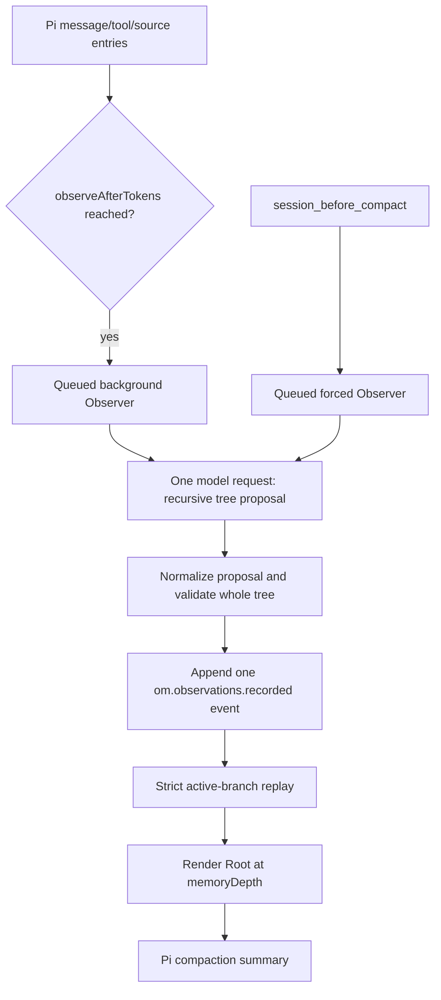

# How Segment Memory works

## Registered surfaces

`src/index.ts` creates one `Runtime` and registers:

| Surface | Role |
|---|---|
| `session_start` | Capture identity/generation, initialize Fork watermarks, and validate memory. |
| `session_before_fork` | Abort stale Observer work and capture source allocation watermarks. |
| `session_tree` | Abort stale Observer work, increment generation, and validate the selected branch. |
| `session_shutdown` | Abort Session-scoped work. |
| `agent_start`, `turn_end` | Trigger due background Observer work. |
| `agent_settled` | Trigger proactive compaction when idle and over threshold. |
| `session_before_compact` | Queue forced Observer, rebuild, depth-render, or cancel safely. |
| `/om:status`, `/om:view` | Diagnose and display the current tree. |
| `om_sessions`, `om_read` | Discover and expand current/historical memory. |

## End-to-end flow

## Source selection

Source entries are `message`, `custom_message`, and `branch_summary` entries. Custom memory entries and compactions are not Observer source.

A valid V4 event advances coverage only when it contains at least one new Observation and a valid `coversUpToId`. Deliberate empty output and failures leave coverage unchanged.

Background runs serialize pending entries oldest-first under `observerChunkMaxTokens`. A single oversized first entry uses a marked head/tail excerpt while keeping its original source ID.

Forced compaction runs do not use this cap. They reread the latest branch after obtaining queue ownership and serialize all pending source once. If that request exceeds the selected model's capacity, compaction is cancelled and raw history remains intact.

## One model request

The Observer agent exposes one `submit_memory_tree` tool. `shouldStopAfterTurn` ends the nested agent immediately after the tool call, so one Observer run makes one provider request rather than a tool-call/acknowledgement round trip.

Input includes:

- pending source with exact labels;
- current Root and its ordered direct children;
- successful Observation batch count;
- whether Segment grouping is required.

Output is a recursive proposal. Code assigns permanent `sN` / `oN` IDs. Observer input retains the Root ID for editing even when direct children are shown. Source entry IDs keep their original Pi values.

## Proposal normalization

Model output is untrusted and handled best effort before persistence:

- invalid Observation: remove it and warn;
- invalid new Segment: remove that layer and promote valid children in order;
- invalid existing Root field: retain the previous field;
- invalid/non-Root existing ID: reject it;
- non-contiguous or overlapping replacements: reject them;
- invalid final structure: retain valid new Observations as ungrouped Root children when possible.

The first transition from one Observation Root to a Segment Root is atomic. If a valid Segment Root cannot be formed, no event or coverage is written.

## Strict replay

Persisted V4 events are trusted output of plugin code and are therefore strict, not best effort. For each event:

1. validate the version-2 envelope, decimal watermarks and every node record;
2. apply Observation creations and Segment versions to a candidate projection;
3. derive parent relationships and unique Root;
4. detect missing/repeated/shared children, cycles, and unreachable nodes;
5. verify chronological Observation leaf order;
6. verify every Segment has at least two direct children;
7. publish only after all checks pass.

Segment non-expansion is a prompt/eval criterion, not a local token-estimate validation rule.

Before branch replay, the whole Session ledger is replayed for allocation watermarks and node births. New IDs exceed the prior watermark, Observation IDs cannot be reused, and Segment updates must refer to nodes born on that branch. No branch switch or compaction rewinds these watermarks.

Any malformed event or invalid final tree raises `MemoryTreeError`. Compact, commands, and tools do not consume the invalid projection.

## Cadence replay

The batch counter is derived from events:

- new Observations + `not_requested`: increment;
- `complete`: reset to zero;
- `partial`: keep Segment work due;
- no new Observation without a Segment check: no event.

Background segmentation becomes required when the next successful batch reaches `segmentEveryObserverRuns`. Forced compaction always requires it.

## Concurrency and stale writes

`Runtime.enqueueObserver` serializes background, forced work, and Fork initialization. Session writers are checked for duplicate ownership within the process; the supported boundary is one Pi process and one active SessionManager per writable Session. This is not a cross-process lock. A forced request queued behind a background request starts a new model call from the then-current branch; it never reuses the background result.

Each run captures Session ID and branch generation. Before append it verifies:

- combined AbortSignal is not aborted;
- Session ID is unchanged;
- branch generation is unchanged;
- the original source branch remains a prefix of the active branch;
- source IDs still exist on the active branch;
- existing refs still resolve in the freshly rebuilt tree.

Nodes and their resulting watermarks share one ledger append. Pi updates its in-memory ledger before writing the file, and can defer the first flush until an assistant message. If append throws or cannot be confirmed, the manager is blocked from further memory reads/writes; reopening the saved Session recovers the committed state. Successful API calls do not supply an fsync guarantee.

`session_tree` and `session_shutdown` abort in-flight work. Duplicate concurrent compaction hooks are cancelled rather than queued.

## Compaction

After forced Observer success:

1. rebuild the committed active-branch tree;
2. if no Root exists, return `undefined` and let Pi use native compaction;
3. render from Root at configured `memoryDepth`;
4. return Pi's original `firstKeptEntryId` and `tokensBefore` with `om.segment-tree.rendered` details.

Forced Observer failure or invalid persisted memory returns `{ cancel: true }`. The hook never uses stale memory to authorize removal of unobserved raw history.

`firstKeptEntryId` controls Pi's raw tail only. It does not filter or deduplicate tree memory.

## Rendering

For each visited Segment:

1. render the title and summary; include `[sN]` only if the Segment is collapsed at this view depth;
2. if depth allows, render direct Observation children as a numbered list with permanent `[oN]` IDs;
3. recursively render child Segments.

Version-2 rendered details include all `renderedNodeIds`, including ancestors with hidden IDs, and `exposedRefs` lists only printed IDs.

Direct Observations and child Segments each preserve their relative order. Repeated rendering of the same tree/depth is deterministic.

## Session discovery and reads

`SessionCatalog` uses Pi's `SessionManager.listAll()` and `SessionManager.open()` rather than owning a filesystem index.

- discovery filters canonical cwd boundaries, valid V4 memory, and optional all-keyword Root matches;
- exact ID lookup ignores cwd and requires one exact match;
- historical reads use the file's standard active branch;
- parent Session IDs are resolved from exact parent file paths when possible, never guessed.

Fork copies existing IDs and adds an `om.node-ids.inherited` event carrying source watermarks, including numbers allocated on branches outside copied ancestry. The metadata changes no memory, coverage, or cadence. An unfinished persisted Fork must be activated for initialization; historical tools do not initialize or modify it. In-memory Forks carry their snapshot across Pi runtime replacement. Missing source information is an initialization error.

`om_read` accepts only exact short IDs in the selected Session; unknown IDs and IDs belonging to another branch produce different errors. It applies the same strict store as compaction. `depth: -1` expands the complete subtree. Child previews retain IDs while their expanded parent heading hides its ID; the limited `om_sessions` navigation list retains Root and preview IDs. JSON/JSONL use the same short IDs for complete parent/child structure and preserve source provenance. File output creates parent directories and returns path/line/byte metadata.

See [the node-ID design](node-reference-design.md) for schema, lifecycle boundaries, and regression coverage.

## Failure behavior

| Failure | Result |
|---|---|
| Background model/API failure | No event or progress; warning and diagnostic state. |
| Forced model/API failure | Cancel compaction. |
| Local proposal defect | Warn and preserve valid local work when invariants allow. |
| Malformed persisted V4 event | Fail replay; block render/compact/read. |
| Session/branch change during request | Abort or reject before append. |
| No memory after successful forced run | Delegate to Pi native compaction. |
| Historical Session missing/corrupt | Exact read returns an error. |
| Export write failure | Tool throws; memory is unchanged. |
