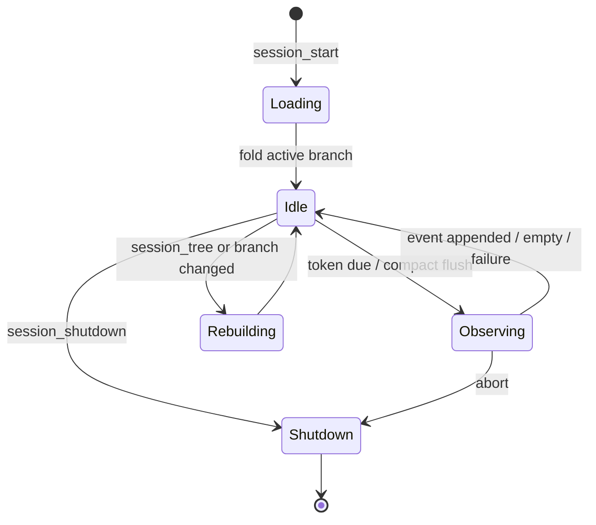
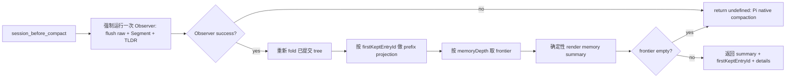

# Segment Memory Tree：插件架构设计与开发计划

> 状态：目标设计与实施计划，不代表当前代码状态
> 目标版本：下一代 Segment Memory（下文简称 V4）
> 依据：`ChatGPT - segment mem 头脑风暴.md`、`om_example.txt`、`segment_memory_tree.md`，并对照当前 V3 实现与 Pi 扩展、Session、Compaction API

## 1. 目标与范围

本次改造要把当前的“Observations + Reflections + Drop”记忆池，演化成一个**以 Observation 为叶子、以事后封闭的工作区间为 Segment、按深度渲染的有序树**。

核心目标：

1. 保留当前已经验证过的 Observation 生成机制和 source provenance。
2. 不再依赖保守而经常无产出的 Reflection/Drop 来控制长期记忆体积。
3. 让旧记忆通过反复的阶段归纳自然变深，让近期记忆自然保持浅层和高细节。
4. Compact 时只按用户配置的 `memoryDepth` 截取树的表示前沿，不设计正常路径上的 token planner、遗忘曲线或节点权重优化器。
5. Observation、Segment forest 和 Root TLDR 由一次 Observer 模型输出共同产生；Observer 每累计配置数量的成功 batches 时自己执行 Segment，每次 Compact 则强制执行。
6. 允许模型主动查看、展开当前或历史 Session 的 Segment/Observation，并最终支持 JSONL 导出。
7. 继续使用 Pi Session JSONL 和 custom entry 持久化，不引入常驻后台进程、SQLite 或另一套中心存储。

非目标：

- 首版不做 HTTP 服务和记忆火焰图。
- 首版不做语义搜索、Embedding、向量索引或跨 Session 自动聚类。
- 首版不按 Segment 自动改写 Pi 的 raw-tail 边界。
- 首版不为异常体积动态降低 `memoryDepth`，也不新增用户可见的 memory token budget。
- 首版不保证 `--no-session` 的临时 Sub-agent 可被跨 Session 查询；它没有可读取的持久 Session。

---

## 2. 输入材料中的设计地位

### 2.1 已确定、必须保持的设计

以下内容来自最新的 `segment_memory_tree.md` 和用户在头脑风暴中的明确取舍，视为硬约束：

- Observation 继续作为最小记忆单位。
- Segment 是**事后**识别出的封闭历史阶段，不是预先创建、等待未来内容挂载的 Plan；“封闭”只表示这段已经发生的工作可以被总结，不要求整体任务成功完成。
- 一个节点只能属于一个父 Segment。
- Segment 至少有 ID、标题、摘要和有序 children。
- 整体是有时间顺序的树：旧侧逐渐变深，新侧保持浅。
- Root 深度为 0；Compact 按固定树深度决定保留 Segment summary 还是继续展开。
- Observer 平时按 token 阈值后台运行；每累计配置数量的成功 batches 时在同一输出中生成 Segment forest，每次 Compact 则强制生成。
- 模型可通过类似 `ls`、`read` 的工具主动展开历史。
- 工具支持可选 Session ID；省略时读取当前 Session。
- 持久化依赖 Pi custom entry；重启时从 branch entries 重建。
- 不使用中央后台进程和 SQLite。
- 火焰图 Inspector 是后续能力，不进入首版。

### 2.2 早期头脑风暴中已被后续讨论否决的方向

以下方向不进入目标架构：

- 以 memory token budget 作为正常渲染策略。
- rate-distortion/frontier optimization。
- recency decay curve、时间衰减函数或 semantic weight。
- node count 作为用户的信息预算。
- 正常路径上的 emergency dynamic depth。

Token 仍用于以下既有、不同语义的地方：

- Observer 输入大小估算和后台 worker 调度。
- Pi proactive compact 的触发进度。
- `/om:status` 和 debug log 中的本地诊断统计。

它不决定树的正常渲染前沿。

### 2.3 `om_example.txt` 暴露的真实问题

该样例中 Observation 大量平铺，包含：

- 长时间调研过程；
- 多轮失败尝试；
- 已经被后续结论覆盖的中间状态；
- 重复验证、review、format、测试和 PR 操作；
- 少量真正长期重要的决策、约束和完成结果。

当前 Reflection 很少或没有时，这些明细会持续进入 Compact memory。Segment Tree 的目标不是删除这些事实，而是把它们组织成阶段，例如：

```text
root
├─ s_issue404_fix
│  ├─ s_root_cause
│  ├─ s_initial_implementation
│  ├─ s_review_and_corrections
│  └─ s_validation_and_pr
├─ s_review_system_comparison
│  └─ ...
└─ recent observations...
```

默认深度下，旧阶段只出现标题和摘要；需要追溯时仍可沿 children 展开到 Observation，再追到原始 Session entry。

---

## 3. 总体设计决定

### 3.1 选择：Segment 替代 Reflection/Drop，而不是叠加在其上

比较过三个结构候选：

| 候选 | 优点 | 主要问题 | 结论 |
|---|---|---|---|
| Segment 覆盖在现有 Reflection/Drop 之上 | 迁移表面最小 | 同一事实同时存在 Observation、Reflection、Segment 三套抽象；两套压缩策略互相决定可见性 | 拒绝 |
| Segment 替代 Reflection/Drop | 单一层次模型；children 同时承担组织和 provenance；深度直接控制细节 | breaking change，旧 Reflection/Drop 路径直接删除 | **采用** |
| 中央 SQLite/服务管理多 Session 图 | 跨 Session 查询方便 | 双写、生命周期、锁、迁移、部署和故障面明显扩大；违背已定约束 | 拒绝 |

目标状态中：

- 保留现有 Observation 的提取规则和 source provenance。
- Reflector、Dropper 及 observation pool/full-fold 机制退出主流程。
- 一个 Observer 模型调用同时承担 Observation 提取、按 cadence 生成 Segment forest、更新 Root TLDR；不再存在第二个 Segment Agent。
- Observation 永不因 Segment 而物理删除；Segment 只是不可变的结构节点。

### 3.2 Root 是虚拟结构节点，并持有最新 Session TLDR

Root 的结构仍由 fold 结果中的顶层 frontier 表示：

```ts
rootChildren: NodeId[]
```

此外，Root 持有一个由 Observer 生成的极短 TLDR，说明该 Session 到目前为止主要做了什么。它是跨 Session discovery 的首要描述；Pi `sessionName` 仍可显示，但第一轮对话产生的标题不能替代对整段 Session 的总结。

每次成功的 Observer run 都更新 Root TLDR；只有 cadence 到期或 Compact 强制时，同一个输出才额外包含 Segment proposal forest。当前 Root 使用 active branch 上最近一次有效 TLDR；尚未成功运行 Observer 的 Session 可以暂时没有 TLDR。

这样既保持 append-only 历史，也自然保留 TLDR 的版本序列。后续火焰图 Inspector 可以沿 Observer event 时间线展示 TLDR 如何变化。

### 3.3 Observer 可以一次提交非平衡的多层树

Observer 的 Segment 阶段不可任意改写既有树，但一次 run 可以创建零到多个、任意深度的新 Segment。新 Segment 的 direct child 可以是运行开始时的 Root child，也可以是同一 event 中新建的 Segment。

整个 proposal forest 必须满足：

1. 展开同轮新 Segment 后，leaf nodes 都来自运行开始时的 Root direct children；
2. 每棵新 subtree 覆盖 Root 上一个连续 slice，并保持原顺序；
3. 不同 top-level proposal subtrees 覆盖的 Root slices 不重叠；
4. 每个节点最多一个 parent，不允许环或重复使用 child；
5. 每个 Segment 至少有两个 direct children；
6. Segment 与 Observation 可以混合作为 children，各分支深度不要求一致。

例如一次 run 可以直接完成两层、非平衡归组：

```text
root before: [A, B, C, D, E]

S1 = Segment(A, B)
S2 = Segment(D, E)
P  = Segment(S1, C, S2)

root after: [P]
```

`P` 的三个分支剩余深度不同：`C` 是直接 Observation，`S1` 和 `S2` 下还有一层。它仍然是合法树，因为最终 leaf 顺序保持为 `[A, B, C, D, E]`。

该约束同时保证单父、无环、非 DAG 和时间顺序不变。TreeStore 对同一 event 的新节点按依赖关系验证，并将 proposal forest 的 top-level roots 原子替换到对应 Root slices。

### 3.4 V1 采用不可变记忆

V1 假设 Observer 已接受的 Observation、Segment 和 TLDR 输出可直接使用。Observation 与 Segment 一经有效 custom entry 写入即不可修改、撤销、替换或重新生成；新的 proposal forest 只能以当前 Root children 为 leaves 继续向上包装，不能改写既有节点内部。

Root TLDR 的“更新”也不修改历史：每次成功的 Observer event 产生一个新的不可变快照，Root 只投影最近一次有效快照。

原始 Session entries 和 `sourceEntryIds` 只用于追溯生成依据，不引入自动正确性判断。V1 不实现 correction、supersede、tombstone、projection reset 或模型重跑纠错。若真实使用证明需要纠错，再基于明确的用户或外部证据，为 Observation 与 Segment 统一设计，而不是只给其中一种节点增加可变语义。

---

## 4. 数据模型

### 4.1 Observation：保留当前生成机制

```ts
type Observation = {
  id: string;                 // 现有 12 位小写 hex content hash
  content: string;
  timestamp: string;          // YYYY-MM-DD HH:MM
  relevance: "low" | "medium" | "high" | "critical";
  sourceEntryIds: string[];
  tokenCount: number;
};
```

Observation 的内容规则、ID、relevance 和 source provenance 保持不变，但与 Segment/TLDR 一起写入统一 Observer event；不再单独启动或持久化一个 Observer Agent 结果。

### 4.2 Segment

```ts
type SegmentId = `s_${string}`;
type NodeId = string; // Observation: 12 hex；Segment: s_<12 hex>

type Segment = {
  id: SegmentId;
  title: string;       // 单行、简短、面向导航
  summary: string;     // 单段纯文本，描述该历史阶段做过的工作及结果/决定/未决项
  childIds: NodeId[];  // 有序，至少 2 个
  tokenCount: number;  // Segment 渲染行的本地估算，仅用于非膨胀校验和本地诊断
};
```

不在 Segment 中重复保存：

- parent ID：由 fold 时谁引用它推导；
- 时间区间：从 descendant Observations 推导；
- source entry IDs：沿 children → Observation → sourceEntryIds 推导；
- leaf count、深度：从树推导；
- Session ID：由所属 Pi Session 决定。

Segment ID 使用 `s_` 命名空间，避免和现有 Observation 的 12 位 ID 发生结构歧义。Hash 输入至少包括规范化后的 `title + summary + ordered childIds`。

### 4.3 Observer 持久化事件

```ts
customType: "om.observations.recorded"
data: {
  version: 1;
  observations: Observation[];
  coversUpToId?: string;
  segmentationOutcome: "not_requested" | "accepted" | "rejected";
  segments: Segment[];
  segmentWarning?: string;
  rootTldr: string;
}
```

一次模型输出只追加一个不可变 event：

- `observations` 保存本轮从 raw source 提取的新叶子；非空时 `coversUpToId` 沿用现有 Observation coverage 语义；
- `segmentationOutcome` 区分未要求 Segment、合法完成（可以没有可封闭区间）和模型生成非法 forest；
- `segments` 只保存通过验证的 Segment；非法 forest 不进入 ledger；
- `segmentWarning` 在 rejected 时保存简短拒绝原因，供即时 warning、status 和 prompt/tool 调优；
- `rootTldr` 每次成功 run 都更新。

同一 event 同时包含新 Observations 和 Segments 时，fold 先把 Observations 追加到 Root，再原子应用 proposal forest，因此 Segment 可以直接包含本轮新生成的 Observation。

### 4.4 Compaction details

```ts
type SegmentMemoryDetails = {
  type: "om.segment-tree.rendered";
  version: 1;
  memoryDepth: number;
  frontierNodeIds: NodeId[];
};
```

`frontierNodeIds` 是本次 Compact 实际渲染出的有序节点，可用于 `/om:view visible` 和可见/当前差异诊断。Root TLDR 已由 Compact 前的 Observer event 持久化，不在 compaction details 中复制。

### 4.5 Session 身份

使用 Pi 已有身份模型：

```ts
type SessionIdentity = {
  id: string;                 // ctx.sessionManager.getSessionId()
  name?: string;              // getSessionName()，仅显示用途
  cwd: string;
  file?: string;              // 临时 Session 可能没有
  parentSession?: string;     // header 中存在时使用
};
```

原则：

- identity = Session ID；
- Session TLDR = 跨 Session discovery 的主要内容描述；
- display label = 可选的 Session name，缺失时可显示文件时间；
- relation = Pi header 的 `parentSession` 或外部 Sub-agent 系统明确提供的关系；
- 不根据名称、cwd 或启动时间猜 parent/child。

首版不重复写一份 `om.session-meta`。如果某个 Sub-agent package 需要补充 `agent`、`role`、`handle`、`parentSessionId`，后续可提供一个窄的 metadata append API；未知字段不应由本插件推测。

---

## 5. 树的权威 fold 逻辑

`MemoryTreeStore` 是 Segment 结构规则的唯一权威。Renderer、Compact、工具和状态命令都只能消费它的结果，不能各自解释 custom entries。

### 5.1 Fold 输入

当前 active branch 上的 entries：

- `om.observations.recorded`
- 其他 entry 仅用于 source 索引、boundary 解析和 Session 信息

### 5.2 Fold 状态

```ts
type MemoryTree = {
  observationsById: Map<string, Observation>;
  segmentsById: Map<SegmentId, Segment>;
  rootChildren: NodeId[];
  parentByChildId: Map<NodeId, SegmentId>;
  rootTldr?: string;
  rootTldrHistory: RootTldrSnapshot[];
  observationBatchesSinceSegmentation: number;
  diagnostics: TreeDiagnostic[];
};
```

### 5.3 Reducer 规则

每个 Observer event 按固定顺序处理：

1. 使用 first-valid-record-wins 加入新 Observations，并按首次记录顺序追加到 Root；
2. `accepted` 时验证并应用本轮 proposal forest；`rejected` event 不含非法 Segment，只记录 warning；
3. 更新 Root TLDR snapshot；
4. 有非空 Observations 且本轮 `not_requested` 时，Observer batch 计数加一；`accepted` 时归零；`rejected` 时保持 Segment due，下一次 Observer 继续尝试。

#### Proposal forest

把 event 的 `segments` 视为一个 proposal forest，整体校验：

1. 新 ID 格式合法、event 内唯一且未存在；
2. title/summary 非空、单行/单段；
3. 每个 Segment 至少两个不重复的 direct children；
4. child 可以是当前 Root node 或同 event 的新 Segment；
5. 新节点依赖图无环，每个 existing/new child 最多一个 parent；
6. 递归展开后，每棵 top-level subtree 的 leaves 都是当前 Root 上保持原顺序的连续 slice；不同 top-level slices 不重叠；
7. 每个 Segment 的渲染 token 数严格小于其 direct children 的渲染 token 总数，该规则按依赖关系自底向上验证。

整个 forest 通过后，将其 top-level roots 原子替换到对应 Root slices，并记录 parent map。malformed event 整体忽略并写 diagnostic；已有效的树不受影响。

#### Root TLDR snapshot

- 按 active branch 上的有效 Observer events 保留 TLDR 时间线。
- 最近一次非空有效 TLDR 是当前 Root summary。
- 新快照不修改旧快照；Observer 失败时没有新 event，继续使用上一版。

### 5.4 核心 invariant

必须始终成立：

1. 每个 Observation/Segment 最多有一个 parent。
2. Root children 没有 parent。
3. 每个非 Root 节点都能沿 parent 到达 Root。
4. children 顺序与 Observation 首次记录顺序一致。
5. Segment 至少有两个 children。
6. Segment 的渲染成本小于直接 children 的渲染成本。
7. 树允许非平衡结构；同一 Segment 下可以同时存在 Segment 和 Observation，child subtrees 深度可以不同。
8. 任何 malformed/unknown entry 都只能被忽略，不能使整个 Session 无法读取。

第 6 条给出首版不需要 memory token planner 的安全依据：

> 平铺全部 Observations 是表示大小上界；每次用 Segment 替换 children 都是严格非膨胀操作，因此任意固定深度 frontier 不会比平铺 Observation baseline 更大。

---

## 6. Observer

### 6.1 职责

Observer 仍负责把新的 raw conversation 提取为 source-backed Observations，但一次模型输出还会：

- 每次更新整个 Session 的极短 Root TLDR；
- cadence 到期或 Compact 强制时，把当前 Root（包括本轮新 Observations）组织成 Segment proposal forest。

Segment 是 Observer 的周期性归组能力，不是第二个 Agent 或第二次模型调用。执行 Segment 时，它只总结已经发生的历史，不预测下一阶段、不删除 Observation、不调整 Compact depth，也不改写既有 Segment。

### 6.2 输入

每次 Observer 接收：

- 上次 coverage 后的新 raw source chunk；Compact 强制运行时该 chunk 可以为空；
- 当前 Root frontier，其中 Observation 提供时间、relevance 和 content，Segment 提供 title、summary、时间范围和 leaf count；
- 当前成功 Observation batch 计数，以及本轮是否必须执行 Segment。

Observer 只需要看 Root frontier，不默认展开已有 Segment 的内部 subtree。

### 6.3 触发与 cadence

```text
turn_end / agent_start
  → 新 raw source 达到 observeAfterTokens
  → 运行一次 Observer
  → 总是输出 Observations + Root TLDR
  → 若本轮成功非空 batch 使计数达到 segmentEveryObserverRuns，则同时输出 Segment forest

session_before_compact
  → 强制运行一次 Observer
  → flush 尚未 Observation 化的 raw source
  → 无视 batch 计数，必须执行 Segment 并更新 Root TLDR
```

计数单位是成功且非空的 Observer batch，不是单条 Observation，也不是 tokens。empty/failure 不计数；成功执行 Segment 后计数归零，即使最终没有创建 Segment。计数由 active branch 上的 Observer events 推导，不维护独立可变 counter。

### 6.4 单次模型输出

Observer 通过一次结构化 `record_observations` 调用返回：

```ts
{
  observations: ObservationProposal[];
  rootTldr: string;
  segments?: SegmentProposal[];
}
```

非 Segment 轮次省略 `segments`。Segment 轮次用嵌套 proposal 表达零到多个、多层非平衡 forest；它可以引用当前 Root nodes 和本轮 Observation proposals。代码生成 Observation IDs 后再自底向上生成 Segment IDs，验证整个 forest，并追加一个不可变 Observer event。该工具调用结束本轮，不再为了 Segment 发起第二次模型请求。

### 6.5 历史区间的封闭判据

生成 Segment 不要求任务成功完成，只要求 children 描述的是已经发生、现在可以准确总结的一段工作：

- 阶段有明确目标、主题或行动脉络；
- 摘要能说明做过什么、当前结果或状态、关键决定/理由和仍然有效的 blocker；
- children 的共同含义明显强于简单的时间相邻；
- 摘要描述已有历史，不依赖未来 Observation 才能成立。

原则上，任何有限的历史工作都可以被分段：调查未得出根因，可以总结已检查内容和未决状态；实现尚未验证，可以总结已完成部分和验证缺口；任务被打断或切换，可以总结停止位置及原因。整体任务之后继续，不会使此前 Segment 失效。

Root 最右侧仍在发展的近期 Observations 可以暂时保持平铺；后续 Observer 执行 Segment 时会把已经成为历史的区间继续组织成更深层次。

典型禁止项：

- 只描述尚未发生的计划，或创建等待未来 children 的空 Segment；
- 仅为了减少节点而把无关工作合并；
- 摘要声称 children 中尚未发生的结果；
- 用“接下来将……”代替对已有工作的总结。

### 6.6 失败语义

- 后台 Observer 模型/API 失败：不写 event、不推进 coverage 或 batch 计数，下次正常触发再试。
- Segment proposal 非法：不持久化非法 Segment；保留有效 Observations 和 Root TLDR，写入 rejected outcome，并向用户 warning 具体拒绝原因；保持 Segment due。
- Compact 中仅 Segment proposal 非法：继续使用有效 Observations 和平铺树渲染，同时 warning；不把它升级为整个 Observer 失败。
- Compact 强制 Observer 整体失败：委托 Pi native compaction，避免未 Observation 化的 source 在自定义 summary 中丢失。
- append 前 Session ID 或 active-branch generation 已变化：放弃整个结果，禁止写入错误 branch。

树退化到平铺 Observation 仍然是正确、可用状态。V1 不为 Session 末尾最后一次失败持久化额外重试状态；若 Session 不再继续，少量平铺尾部无关紧要。

---

## 7. 后台执行与并发状态机

### 7.1 Session 生命周期



`session_start`：

- 读取 config；
- 捕获 Session ID 和 active-branch generation；
- fold 当前 active branch；
- 创建本 Session/branch 的 `AbortController`。

`session_tree`：

- active branch 变化时递增 generation、abort 当前 Observer，并从新 branch 重建 tree cache。

`session_shutdown`：

- abort Observer；
- 清理 cache、timer 和未来 Inspector 资源；
- 旧闭包不得在 replacement Session 上 append。

### 7.2 单写原则

同一插件 Runtime 中只允许一个 Observer run：

```text
Idle → Observer → Idle
```

后台 token trigger 与 Compact flush 经过同一个串行队列，不并行运行两个 Observer。Compact 若遇到正在运行的后台 Observer，其 forced Observer 请求排在后面；取得单写执行权后重新读取最新 branch、重新 fold，并运行一轮新的 forced Observer。旧 Observer 的结果可以先正常提交，但绝不复用为本次 Compact 的 forced run。

### 7.3 提交前复验

后台模型调用结束后，在 `appendEntry` 前必须：

1. 检查 AbortSignal；
2. 检查 Session ID 和 active-branch generation 未变；
3. 重新读取当前 branch；
4. 重新 fold Root frontier；
5. 重新验证本轮 Observations 的 source entries 仍属于该 branch，proposal forest 仍基于当前 Root frontier。

这使模型调用期间新增普通 conversation entries 不会破坏提交；若发生 branch/session replacement，则安全放弃。

---

## 8. Compact 执行逻辑

### 8.1 深度渲染

配置：

```json
{
  "observational-memory": {
    "memoryDepth": 2
  }
}
```

定义：

- Root depth = 0；
- Root child depth = 1；
- Observation 被访问到时直接进入 frontier；
- Segment depth `< memoryDepth` 时继续访问 children；
- Segment depth `>= memoryDepth` 时停止并进入 frontier。

伪代码：

```ts
function frontier(node, depth, memoryDepth): Node[] {
  if (node.kind === "observation") return [node];
  if (depth >= memoryDepth) return [node];
  return node.children.flatMap(child => frontier(child, depth + 1, memoryDepth));
}
```

默认 `memoryDepth = 2`：

- 老历史通常命中二级 Segment summary；
- 中近期一级 Segment 会展开；
- 尚未进入 Segment 的 Root Observations 保持原文。

### 8.2 必须先按 Pi compaction boundary 做前缀投影

Compact 不能直接渲染整棵树，否则会把仍在 raw tail 中的近期内容重复写进 summary。

以 `preparation.firstKeptEntryId` 为边界，对每个节点分类：

- **before**：所有 descendant Observation 的所有可解析 source entries 都在 boundary 之前；
- **after**：所有 descendant Observation 的所有可解析 source entries 都从 boundary 开始或位于其后；
- **mixed**：Segment 同时覆盖 boundary 前后；
- **unknown**：任一 descendant source 缺失或无法定位。

规则：

1. `before` 节点按正常 `memoryDepth` 规则渲染。
2. `after` 节点跳过，由 Pi raw tail 保留。
3. `mixed` Segment 即使已到 cutoff depth 也不能直接用 summary，因为 summary 含 raw tail 信息；必须递归 children，直到得到纯 `before` 子节点。
4. 跨 boundary 的单个 Observation 整体跳过，让 retained raw source 承担其信息，避免部分事实重复。
5. `unknown` 节点不进入 compaction summary，并在 status/debug 中报告；不能在证据边界不明时猜测。

这会让极少数跨 boundary 的 Segment 临时比配置深度展开得更细，但它保持了 summary 与 raw tail 的无重叠语义。后续 Compact 边界越过整个 Segment 后，它会恢复正常 cutoff summary。

### 8.3 Hook 路径



Compact 不自动修改 `memoryDepth` 或做 token optimization。强制 Observer 是唯一模型调用：它处理尚未达到 token threshold 的 raw tail、执行 Segment 并更新 Root TLDR。调用失败时委托 Pi native compaction，避免未进入 Observation 的 source 被自定义 summary 遗漏。

### 8.4 Summary 格式

Compact memory 仍使用扁平 representation frontier，不显示被展开但未进入 frontier 的中间 Segment。Root TLDR 主要用于跨 Session discovery，不代替下面的 Session 内 memory summary：

```md
These are condensed memories from earlier in this session.

- Segment entries are completed historical phases. Use memory_read to expand them.
- Observation entries are source-backed events. Use memory_read to inspect provenance.
- Newer records supersede conflicting older records.

## Memory
[s_a1b2c3d4e5f6] Fix npm extension peer resolution — Root cause was the temporary npm peer boundary; the final patch reused host VIRTUAL_MODULES, corrected Loaded reconciliation, passed validation, and opened PR #405.
[47d4aa7245bb] 2026-08-22 09:07 [medium] agentic-review has an unresolved scalability risk...
```

Segment 行必须同时含 ID、title、summary；Observation 行沿用当前格式。

### 8.5 为什么首版不需要 token fallback

只要每个 Segment 满足：

```text
render(segment) < Σ render(direct children)
```

树渲染就是对平铺 Observation baseline 的一系列非膨胀替换。用户已经有“全部 Observations 平铺也可正常工作”的真实使用证据，因此首版只在本地状态中显示渲染 token 估算，不添加动态降深或 hard-cap 行为。

若真实数据反驳该判断，第一排查对象是：

- Observer 的 Segment 阶段是否长期不产出；
- Segment summary 是否未实际压缩；
- 大量旧节点是否仍停留在 Root；

而不是先引入新的 planner。

---

## 9. 主动读取与跨 Session 查询

跨 Session 查询只使用稳定的 Session ID 作为身份。插件不引入 `project`、Git repository 或 cwd ownership 等新的领域概念；cwd、目录前缀、仓库位置和本地索引都只能作为寻找 Session 文件的实现手段，不能改变 Session ID 的含义或限制可查询范围。

目标公共能力保持三个工具，职责分离：

1. `memory_sessions`：发现可读 Session。
2. `memory_ls`：查看某个树节点的 direct children。
3. `memory_read`：读取节点/subtree；Observation 可继续展开到原始 source。

### 9.1 `memory_sessions`

用途：解决“过去有哪些带记忆的 Session、ID 是什么”。

它从本机可访问的 Pi Session 中发现带记忆的 Session，并支持必要的搜索、过滤和分页。具体使用 cwd prefix、Git 仓库位置、Pi 本地目录或其他索引属于可替换的定位实现，不进入 memory identity 契约。

输出每项：

- exact Session ID；
- 最新 Root TLDR（若该 Session 已成功生成）；
- 可选 `sessionName` 和 cwd；
- Session 文件时间范围；
- parentSession（若 Pi header 提供）；
- Observation/Segment 数；
- Root frontier 数和最大深度；
- 顶层最多 3 个 Segment/Observation 的短预览。

Session locator 使用一个统一机制：扫描 Pi 的本地 Session catalog，并按 exact Session ID 定位任意本地持久化的 Session。它不以当前 cwd、Git 仓库或目录层级限制查询。`memory_sessions` 可以提供搜索或过滤来帮助发现 ID，但这与 exact-ID locator 是两件事。

只对候选文件做只读打开，过滤没有 OM Observation/Segment entries 的 Session，并分页返回，禁止一次把所有 Session 内容注入模型上下文。不维护额外索引或真源。

### 9.2 `memory_ls`

输入：

```ts
{
  sessionId?: string; // 默认当前 Session，必须 exact match
  nodeId?: NodeId;    // 默认虚拟 root
  limit?: number;
  cursor?: string;
}
```

输出 direct children：

- ID、kind、position；
- Segment title/summary、时间范围、child count、leaf count；
- Observation 时间、relevance、content；
- 是否还有下一页。

`memory_ls` 不递归，也不返回 raw source，因此输出可控且适合导航。

### 9.3 `memory_read`

输入：

```ts
{
  sessionId?: string; // 默认当前
  nodeId?: NodeId;    // 默认 root
  depth?: number;     // 默认 1；0 只读节点自身
  includeSources?: boolean;
  format?: "markdown" | "json" | "jsonl";
  outputPath?: string;
}
```

行为：

- 读取 Segment：返回 title、summary、children，并按 `depth` 展开。
- 读取 Observation：返回完整 Observation；`includeSources=true` 时解析原始 source entries。
- 读取 Root：返回该 Session 的最新 TLDR 和树视图。
- `format=json/jsonl` 返回稳定机器可读结构。
- 指定 `outputPath` 时写完整结果，工具响应只返回路径、行数、字节数和摘要；未指定时遵循 Pi 工具输出截断约定并提供 continuation。

JSONL 导出采用可分析的扁平记录：

```json
{"recordType":"session","sessionId":"...","name":"...","cwd":"..."}
{"recordType":"node","sessionId":"...","nodeId":"s_...","parentId":null,"position":0,"kind":"segment","title":"...","summary":"..."}
{"recordType":"node","sessionId":"...","nodeId":"064d...","parentId":"s_...","position":0,"kind":"observation","timestamp":"...","relevance":"high","content":"..."}
{"recordType":"source","sessionId":"...","observationId":"064d...","sourceEntryId":"entry...","entryType":"message","content":"..."}
```

这允许 shell、Python、Polars、DuckDB 直接处理，同时保持 node/edge/source 关系。

### 9.4 跨 Session 边界

- 省略 `sessionId`：只读当前 Runtime 的 active branch。
- 指定 `sessionId`：通过通用 Session locator 做 exact match，定位后 read-only open；与当前 cwd、Git 仓库或目录层级无关。
- 历史 Session 使用 Pi 打开/恢复该 Session 时给出的标准 branch；V1 不自行发明“最新 leaf”等选择规则，也不新增 branch 查询接口。
- `--no-session` 没有文件，退出后不可查询。
- Sub-agent 只有在 child Pi 中加载本插件、且 child 没有使用 `--no-session` 时才有独立可查询记忆。
- Discovery 可能发现任意本地持久化的 Pi Session；工具描述必须明确其本地数据可见范围。

---

## 10. 配置

### 10.1 V4 首版配置

```ts
type Config = {
  observeAfterTokens: number;
  observerChunkMaxTokens?: number;
  segmentEveryObserverRuns: number; // 新增，默认 2；正整数
  compactAfterTokens: number;
  compactAfterTokensMode: "calibrated" | "ratio";
  compactAfterTokensRatio: number;
  memoryDepth: number;          // 新增，默认 2；非负整数
  model?: ConfiguredModel;
  showWorkerNotifications: boolean;
  passive: boolean;
  debugLog: boolean;
};
```

移除：

- `reflectAfterTokens`
- `observationsPoolMaxTokens`
- `observationsPoolTargetTokens`

不新增：

- `memoryBudgetTokens`
- `segmentAfterTokens`（改用 `segmentEveryObserverRuns`）
- `maxFrontierNodes`
- recency/semantic 权重

### 10.2 Passive 语义

`passive=true`：

- 不在 turn lifecycle 中后台运行 Observer；
- 不主动触发 auto-compact；
- manual/Pi compaction hook、status、view、memory tools 仍可用；发生 Compact 时仍按统一流程强制运行一次 Observer，失败则委托 Pi native compaction。

### 10.3 Breaking-change 边界

该实现从现有版本 fork 出来，明确允许 breaking change：

- 只定义新配置 schema，删除的 Reflection/Pool 配置不提供迁移层；
- 不承诺读取、继续或原地升级旧版 Session memory；
- 不设计 V3 Observation/Reflection/Drop 导入、双读、回滚或兼容周期；
- 跨 Session 工具只对本版本产生的 Segment Memory Session 承诺正确行为。

现有代码仍作为 Observer、Pi 集成和 provenance 的实现参考，不构成数据兼容要求。

---

## 11. 新 Session 格式边界

Segment Memory Tree 从使用本版本创建的新 Session 开始建立。旧版 Session 文件可以继续由旧版本保留，但不进入本架构的运行、测试和发布验收范围。

---

## 12. 目标模块边界

在复用现有代码的前提下，目标目录如下：

```text
src/
├─ agents/
│  └─ observer/                 # Observation + cadence Segment + Root TLDR，一次模型调用
├─ memory-tree/
│  ├─ types.ts                  # Observation/Segment/events/type guards
│  ├─ fold.ts                   # 唯一 event reducer + invariants
│  ├─ project.ts                # Pi boundary prefix projection
│  ├─ render.ts                 # depth frontier + deterministic summary
│  ├─ inspect.ts                # ls/read DTO，不含 Pi UI
│  └─ export.ts                 # JSON/JSONL records
├─ sessions/
│  └─ catalog.ts                # 本地 Pi Session discovery/exact-ID resolve
├─ hooks/
│  ├─ consolidation-trigger.ts  # token cadence → Observer
│  ├─ compaction-trigger.ts     # 复用
│  └─ compaction-hook.ts        # prefix projection → frontier → render
├─ tools/
│  ├─ memory-sessions.ts
│  ├─ memory-ls.ts
│  └─ memory-read.ts
├─ commands/
│  ├─ status.ts
│  └─ view.ts
├─ config.ts
├─ runtime.ts
└─ index.ts
```

### 12.1 复用

直接复用或小改：

- `src/agents/observer/*`
- `src/runtime.ts` 的 model/auth 解析规则
- `src/serialize.ts` 的 source serialization
- `src/tokens.ts` 的本地估算
- `src/hooks/compaction-trigger.ts`
- `src/debug-log.ts`
- 当前 Observation provenance 和 recall source rendering

### 12.2 删除/退出主流程

实现新架构时删除：

- `src/agents/reflector/*`
- `src/agents/dropper/*`
- Reflection/Drop projection、coverage 和 pool 逻辑
- full-fold pressure 相关配置和状态输出

实现过程中允许短暂存在未引用文件，但最终 PR 不保留“双架构”死代码。

### 12.3 知识所有权

| 设计知识 | 唯一所有者 |
|---|---|
| Segment 结构合法性、单父、连续 range | `memory-tree/fold.ts` |
| source boundary 与 mixed Segment 处理 | `memory-tree/project.ts` |
| depth cutoff | `memory-tree/render.ts` |
| Observation/Segment/TLDR 模型语义 | Observer prompt/agent |
| Observer batch cadence、branch generation、in-flight | `runtime.ts` + consolidation hook |
| Session ID 到文件解析 | `sessions/catalog.ts` |
| Root TLDR 生成与版本持久化 | Observer + `om.observations.recorded` |
| 导出 schema | `memory-tree/export.ts` |

工具、commands 和 hooks 不重复实现上述规则。

---

## 13. 可观测性与诊断

### 13.1 `/om:status`

V4 输出：

```text
── Memory tree ──
Observations: 248
Segments: 37
Root frontier: 12 nodes (4 segments, 8 observations)
Tree depth: max 5
Render depth: 2
Rendered frontier: 19 nodes / ~6,420 tokens
Flat observation baseline: ~31,800 tokens
Compression vs flat: 79.8%

── Activity ──
Next observation: ...
Next segmentation: 1 / 2 successful Observer batches
Next compaction: ...
Observer: idle | running
Last observer error: ...

── Diagnostics ──
Rejected persisted segments: 0
Unknown source boundaries: 0
```

这些 Token 数只用于本地诊断显示，不发送到外部，也不控制正常行为。

### 13.2 Debug log

新增事件：

- `observer.start`
- `observer.recorded`
- `observer.segmented`
- `observer.segment_rejected`
- `tree.rebuilt`
- `tree.invalid_entry`
- `render.completed`
- `render.unknown_boundary`

默认记录 ID、count、token、depth、compression ratio 和错误，不记录完整 conversation/prompt/summary 内容。

### 13.3 火焰图后续准入条件

只有当 CLI status 无法解释以下问题时再实现 HTTP Inspector：

- 哪一段旧历史长期停在浅层；
- 哪个 Segment summary 压缩率异常；
- depth 1/2/3 的 frontier 差异；
- Observer 的 Segment cadence 是否过度或不足归纳。

Inspector 还应沿 Observer event 时间线展示 Root TLDR，让用户看到 Session 的整体描述如何随工作推进而变化；这些历史版本直接来自已有 `om.observations.recorded` entries，不另建一套存储。

实现时由 `/om:inspect` 启动 localhost 随机端口服务，并在 `session_shutdown` 关闭；不在 extension factory 启动常驻资源。

---

## 14. 错误处理与恢复

| 场景 | 行为 |
|---|---|
| 后台 Observer 模型不可用 | 不写 event、不推进 coverage/batch 计数；保留原始 Session；通知一次 |
| Segment proposal 非连续/重叠 | 拒绝 proposal；不修改树 |
| Segment summary 不压缩 | 拒绝 proposal；让 agent 缩短后重试 |
| malformed persisted custom entry | 忽略该 entry；记录 diagnostic |
| sourceEntryId 在 branch 中缺失 | Observation 仍可读；Compact prefix projection 不猜 boundary；source read 标 partial |
| Compact 时 tree 为空 | 不接管，委托 Pi native compaction |
| Compact 强制 Observer 整体失败 | 委托 Pi native compaction，不使用可能遗漏未观察 source 的自定义 summary |
| Segment forest 非法 | 丢弃非法 Segment，保留有效 Observations/TLDR，warning 并保持 Segment due；Compact 可继续平铺渲染 |
| Compact 与后台 Observer 相遇 | forced run 串行排队；获得执行权后基于最新 branch 重新运行，不复用旧 run |
| Session/branch 在模型调用期间切换 | Abort 或 active-branch generation 校验失败，禁止 append |
| 历史 Session 文件不存在/损坏 | 工具返回明确错误，不回退到名称猜测 |
| 导出路径写失败 | 工具失败且不报告成功；内存不受影响 |
| Segment ID 极小概率冲突 | first-valid wins，后续冲突 proposal 拒绝并记录 diagnostic |

---

## 15. 测试策略与验收条件

### 15.1 Pure tree tests

至少覆盖：

- Observations 按首次记录顺序进入 Root；
- 连续 Root children 被 Segment 原位替换；
- 非连续、逆序、重复、缺失、已归属 child 被拒绝；
- 同批多 Segment 不重叠并保持顺序；
- Segment 可同时包装 Segment 与 Observation，且各 child subtree 深度可以不同；
- 不可产生多父或 cycle；
- branch fold 只读取 active path；
- malformed/unknown events 被忽略；
- Segment 渲染成本不小于 children 时拒绝。

### 15.2 Render tests

以 `segment_memory_tree.md` 中的示例树做 golden test：

- depth 0、1、2、3 frontier；
- 旧 Segment summary + 近期 Observations 的顺序；
- flat depth 输出与全部 Observations baseline 一致；
- 任意有限 depth 的估算 token 不超过 flat baseline；
- Segment/Observation 行包含可用于工具读取的 ID。

### 15.3 Boundary projection tests

- 整个 Segment 在 `firstKeptEntryId` 前：可按 depth collapse；
- 整个 Segment 在后：不进 summary；
- Segment 跨 boundary：强制展开并只保留纯 before children；
- 单 Observation source 跨 boundary：整体跳过；
- source ID 缺失：不猜测并产生 diagnostic；
- raw tail 与 memory summary 不包含同一完整 Observation。

### 15.4 Observer/Segment tests

- 一次 Observer 模型输出同时包含 Observations、Root TLDR 和可选 Segment forest；
- 每个成功 run 只写一个 event；
- 成功非空 batch 计数，empty/failure 不计数；
- 第 2 个成功 batch 执行 Segment 并归零；
- Compact 无视计数强制 Segment，并 flush 未达到 token threshold 的 raw source；
- 单次可提交嵌套、多层、非平衡 proposal forest；代码自底向上生成 ID 并验证依赖；
- 无效 Segment forest 不丢弃同轮有效 Observations/TLDR，不进入 ledger，并产生用户可见 warning；
- rejected Segment 不重置 cadence，下一次 Observer 继续尝试；
- Compact 仅 Segment rejected 时继续平铺渲染；Observer 整体 failure 才委托 Pi native compaction。

### 15.5 Lifecycle/race tests

- `session_shutdown` abort worker；
- Session ID 或 active-branch generation 改变后不 append；
- proposal 返回期间 Root frontier 改变会复验并拒绝；
- Compact forced Observer 与后台 Observer 串行排队，且 forced run 基于最新 branch 新跑一轮；
- Root TLDR 写入 Observer event，fold 使用最新有效版本并保留历史；
- Compact Observer 失败时委托 Pi native compaction；
- duplicate compact hook 有明确处理；
- `/tree` 导航后 cache 按新 branch 重建。

### 15.6 Cross-session/tool tests

- 默认 current Session；
- exact Session ID 查找；
- exact Session ID 可跨 cwd/仓库定位；
- 无记忆 Session 被 catalog 过滤；
- ephemeral Session 只在当前 Runtime 可读；
- `memory_sessions` 返回最新 Root TLDR；
- `memory_ls` pagination；
- `memory_read` Root 返回 TLDR，Observation 返回 source provenance；
- JSONL 每行可独立 `JSON.parse`，parent/position 可重建同一树；
- output truncation 和完整文件导出。

### 15.7 回归命令

每阶段最低验证：

```bash
npm test
npm run typecheck
```

### 15.8 发布验收

V4 首版必须同时满足：

1. 每次 Observer 只发起一个模型请求，同时生成 Observations、Root TLDR 和到期时的 Segment forest。
2. `segmentEveryObserverRuns` 默认 2；每次 Compact 无视计数强制 Segment，Observer 失败则委托 Pi native compaction。
3. 默认 `memoryDepth=2`。
4. 没有正常渲染 token budget/planner。
5. 每个有效节点最多一个 parent。
6. 每个 top-level proposal subtree 必须覆盖连续 Root range；单次 Observer 可创建任意深度的非平衡 forest。
7. 每个 Segment 是严格非膨胀表示。
8. Segment 阶段没有产出时，系统仍退化为可用的平铺 Observation memory。
9. Observation → source entry 的追溯保持可用。
10. 当前和本版本创建的持久化 Session 可通过 exact ID 导航。

---

## 16. 分阶段开发计划

### Phase 0：冻结需要保留的行为

目标：在结构改造前保护仍要复用的能力，不建立旧数据兼容层。

任务：

- 为现有 Observer、source provenance 和 model/auth 补足必要 characterization tests。
- 从 `om_example.txt` 提取代表性的 Observation 内容作为新树的设计 fixture，不导入旧 ledger 语义。

退出条件：现有 `npm test`、`npm run typecheck` 通过；后续可安全删除 Reflection/Drop 而不会误删 Observer 和 source provenance 能力。

### Phase 1：实现纯 Segment Tree core

目标：先完成无 Pi UI、无模型的权威数据层。

任务：

- 增加 Segment types/type guards/builders。
- 实现 fold reducer、Root range replacement 和 diagnostics。
- 实现 depth frontier renderer。
- 实现 `firstKeptEntryId` prefix projection 和 mixed Segment 规则。
- 写 pure unit/golden/property-style invariant tests。

退出条件：给定任意合法/恶意事件序列，fold 不抛错且 invariant 成立；render 不超过 flat baseline。

### Phase 2：扩展 Observer 并改造后台 pipeline

目标：把当前 `Observer → Reflector → Dropper` 改成单次 Observer 模型调用。

任务：

- 扩展 Observer prompt 和单次结构化输出，同轮返回 Observations、Root TLDR，以及到期时的多层非平衡 Segment forest。
- 用统一 `om.observations.recorded` event 原子保存结果。
- 从 ledger 推导成功非空 batch 计数；`segmentEveryObserverRuns` 默认 2，达到 cadence 时启用 Segment 输出并在成功后归零。
- 增加 Session abort 和 active-branch generation；append 前复验 source branch 与 Root frontier。
- 删除 Reflector/Dropper 调用和第二个 Segment Agent 概念。

退出条件：每个后台 trigger 只有一个模型请求和一个 event；empty/failure 不推进 coverage/cadence；并发切换不产生 stale append。

### Phase 3：切换 Compact、配置和命令

目标：让用户真正使用 depth-based memory。

任务：

- `compaction-hook` 在渲染前通过单写入口强制运行一次 Observer，flush pending raw source，并无视 cadence 生成 Segment forest 与 Root TLDR。
- Observer 成功后 fold 统一 event，再执行 prefix projection → depth frontier → deterministic render；失败则委托 Pi native compaction。
- compaction details 只保存 `memoryDepth` 和 rendered frontier。
- 新增 `memoryDepth` 与 `segmentEveryObserverRuns`（默认 2），移除三个 Reflection/Pool 配置。
- `/om:status` 显示树深度、frontier 和估算压缩比例。
- `/om:view` 支持当前 tree 和最近一次 visible frontier。
- 保持空 tree 委托 Pi native summarizer。

退出条件：手动、proactive、Pi overflow compaction 都先强制运行一轮 Observer，再走同一树投影路径；默认 depth 2 行为通过 golden tests；Observer 失败时由 Pi native compaction 保底。

### Phase 4：主动读取、跨 Session 与导出

目标：完成“树可收缩，也可按需展开”的闭环。

任务：

- 实现通用 `SessionCatalog`，支持本地 discovery 和不受 cwd/仓库限制的 exact Session ID 定位。
- 注册 `memory_sessions`、`memory_ls`、`memory_read`。
- 将现有 recall source 解析复用到 `memory_read`。
- 增加 JSON/JSONL DTO 与 `outputPath` 导出。

退出条件：模型可从 Session discovery → Root ls → Segment read → Observation source read 完成跨 Session 追溯；JSONL 可被脚本逐行解析。

### Phase 5：删除旧架构并发布文档

目标：不留下双系统。

任务：

- 删除 Reflector、Dropper、coverage、pool、full-fold 代码和测试。
- 更新 README、concepts、how-it-works 和 configuration，明确这是 breaking-change fork。
- 用真实长 Session 运行 depth 1/2/3 对比，记录本地渲染 token 估算和树形状。
- 最终运行全量测试/typecheck，并对大 Session 做手工 compact/ls/read/export smoke test。

退出条件：代码中只有一个 memory truth 和一个 renderer；文档不再描述已删除的 Reflection/Drop 主流程。

### Phase 6（真实证据触发，不属于首版）：Tail boundary 与 Inspector

只有在 V4 上线数据证明有收益空间时评估：

- 以 Segment/Observation source span 对齐 `firstKeptEntryId`；
- 对齐前后 raw-tail token、重复率和继续任务质量 A/B；
- localhost 随机端口火焰图。

没有测量，不进入实现。

---

## 17. 关键风险与重新评估触发器

| 风险 | 当前控制 | 何时重新设计 |
|---|---|---|
| Observer 的 Segment 阶段长期不产出，Root 继续平铺 | 平铺仍正确；status 暴露 Root/深度 | 真实 workload 中 depth=2 长期接近 flat baseline |
| Observer 过度归纳 | 历史区间判据、每 Segment 至少两 child、source 可追溯 | read 经常需要立刻展开且 summary 无法支持继续任务 |
| Summary 丢失关键细节 | childIds 保留完整 subtree；memory_read 可展开 | 经常出现“必须展开才能避免错误决策” |
| 跨 boundary Segment 重复 raw tail | mixed Segment 强制递归 | 仍可构造同一 Observation 同时进入 summary/raw 的反例 |
| Observer model context 不够同时容纳 raw chunk 与 Root frontier | 失败不推进 coverage；Compact 失败委托 Pi native | context failures 可复现且持续发生 |
| Sub-agent Session 不可见 | 明确要求持久 child + 插件加载 | 目标 Sub-agent package 提供稳定 parent/child metadata contract |

---

## 18. 最终端到端执行示例

```text
1. 用户与 Pi 工作，Session 正常追加 message/tool entries。
2. 第一次达到 observeAfterTokens。
3. Observer 用一次模型请求读取 raw chunk 和 Root，输出 O101..O103 与 Root TLDR；batch count 变为 1，尚不执行 Segment。
4. 第二次达到 observeAfterTokens。
5. Observer 仍只用一次模型请求，输出新 Observations、更新后的 Root TLDR，以及多层 Segment proposal forest；因为 count 达到默认 2，本轮执行 Segment。
6. 代码先生成 Observation IDs，再自底向上生成/验证 Segment IDs，追加一个 om.observations.recorded event；batch count 归零。
7. TreeStore fold 该 event：先追加新 Observations，再原子应用 forest，Root 因而变浅而旧历史变深。
8. Pi 触发 Compact，即使 pending raw 尚未达到 observeAfterTokens，也强制运行一次 Observer。
9. Observer 同一次输出 flush pending raw、执行 Segment 并更新 TLDR；成功后重新 fold，失败则委托 Pi native compaction。
10. 成功路径按 firstKeptEntryId 和 memoryDepth=2 确定性渲染。
11. 跨 Session discovery 读取最新 TLDR，后续 Inspector 可展示历次 Observer event 中的变化。
12. 需要细节时：
    memory_sessions → memory_ls → memory_read(S_fix) → memory_read(O102, includeSources=true)。
13. 需要周/月复盘时，对多个 exact Session ID 导出 JSONL，再用 shell/Python/Polars/DuckDB 分析。
```

这套执行逻辑把责任固定为：

- **Observer**：一次模型调用完成 Observation 提取、Root TLDR 更新，并按 batch cadence 或 Compact 强制执行 Segment。
- **TreeStore**：拥有结构合法性、cadence fold 和唯一父关系。
- **Prefix Projector**：拥有 Compact boundary 正确性。
- **Depth Renderer**：只决定当前保留几层细节。
- **Pi Session**：拥有身份、branch、持久化和 raw-tail 生命周期。
- **Memory tools**：负责按需展开，不参与记忆生成。

最终系统没有第二套数据库，也没有 token planner；当 Observer 的 Segment 阶段没有产出时，它退化为已经被真实使用验证过的平铺 Observation 模式。
