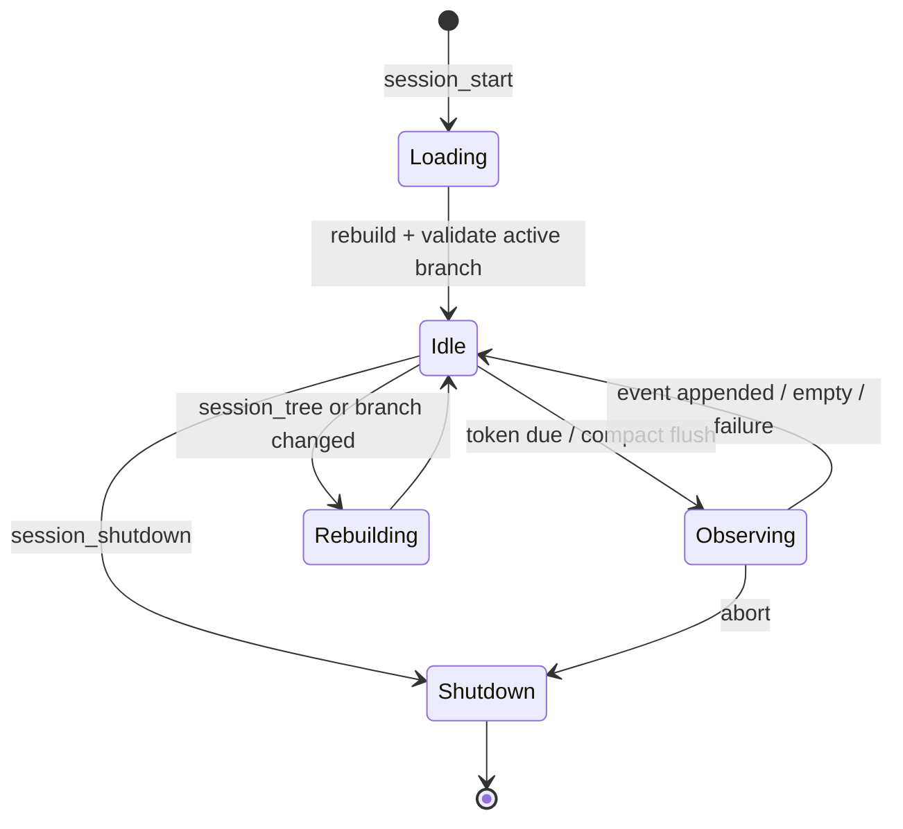
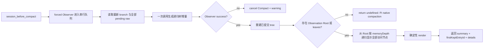

# Segment Memory Tree：插件架构设计与开发计划

> 状态：目标设计与实施计划，不代表当前代码状态
> 目标版本：下一代 Segment Memory（下文简称 V4）
> 依据：`ChatGPT - segment mem 头脑风暴.md`、`om_example.txt`、`segment_memory_tree.md`，并对照当前 V3 实现与 Pi 扩展、Session、Compaction API

## 1. 目标与范围

本次改造要把当前的“Observations + Reflections + Drop”记忆池，演化成一个**以 Observation 为叶子、以事后封闭的工作区间为 Segment、以当前唯一无 parent 节点为 Root、按深度渲染的有序树**。

核心目标：

1. 保留当前已经验证过的 Observation 语义提取、coverage 和 source provenance；删除只服务于 V3 平铺/Dropper 的 timestamp、relevance 和持久化 tokenCount。
2. 不再依赖保守而经常无产出的 Reflection/Drop 来控制长期记忆体积。
3. 让旧记忆通过反复的阶段归纳自然变深，让近期记忆自然保持浅层和高细节。
4. Compact 时只按用户配置的 `memoryDepth` 从 Root 递归展示节点；每个访问到的 Segment 和 Observation 都保留，不设计正常路径上的 token planner、遗忘曲线或节点权重优化器。
5. Observer 用一次结构化模型输出返回递归嵌套的树增量：新 Observation、新 Segment 和已有 Root Segment 的新版本共用一种节点结构；Observer 每累计配置数量的成功 batches 时自己执行 Segment，每次 Compact 则强制执行。
6. 允许模型主动查看、展开当前或历史 Session 的 Segment/Observation，并最终支持 JSONL 导出。
7. 继续使用 Pi Session JSONL 和 custom entry 持久化，不引入常驻后台进程、SQLite 或另一套中心存储。

非目标：

- 首版不做 HTTP 服务和记忆火焰图。
- 首版不做语义搜索、Embedding、向量索引或跨 Session 自动聚类。
- 首版不按 Segment 自动改写 Pi 的 raw-tail 边界。
- 首版不为异常体积动态降低 `memoryDepth`，也不新增用户可见的 memory token budget。
- 首版不保证 `--no-session` 的临时 Sub-agent 可被跨 Session 查询；它没有可读取的持久 Session。

---

## 2. 输入材料中的设计地位

### 2.1 已确定、必须保持的设计

以下内容来自最新的 `segment_memory_tree.md` 和用户在头脑风暴中的明确取舍，视为硬约束：

- Observation 继续作为最小记忆单位。
- 非 Root Segment 是**事后**识别出的封闭历史阶段，不是预先创建、等待未来内容挂载的 Plan；“封闭”只表示这段已经发生的工作可以被总结，不要求整体任务成功完成。Segment Root 覆盖整个持续发展的 Session，不受封闭区间约束。
- Root 没有 parent；除此之外，每个当前节点必须恰好属于一个父 Segment。
- Segment 至少有 ID、标题、摘要和有序 children。
- 整体是有时间顺序的树：旧侧逐渐变深，新侧保持浅。
- Root 是深度为 0、唯一没有 parent 的节点：第一个 Observation 自身是 Root，第二个出现后创建一个 Segment 作为新 Root。
- Observer 平时按 token 阈值后台运行；每累计配置数量的成功 batches 时在同一递归树增量中生成 Segment，每次 Compact 则强制生成。
- 模型可通过类似 `ls`、`read` 的工具主动展开历史。
- 工具支持可选 Session ID；省略时读取当前 Session。
- 持久化依赖 Pi custom entry；重启时从 branch entries 重建。
- 不使用中央后台进程和 SQLite。
- 火焰图 Inspector 是后续能力，不进入首版。

### 2.2 早期头脑风暴中已被后续讨论否决的方向

以下方向不进入目标架构：

- 以 memory token budget 作为正常渲染策略。
- rate-distortion optimization。
- recency decay curve、时间衰减函数或 semantic weight。
- node count 作为用户的信息预算。
- 正常路径上的 emergency dynamic depth。

Token 仍用于以下既有、不同语义的地方：

- Observer 输入大小估算和后台 worker 调度。
- Pi proactive compact 的触发进度。
- `/om:status` 和 debug log 中的本地诊断统计。

它不改变按 `memoryDepth` 递归展示节点的结果。

### 2.3 `om_example.txt` 暴露的真实问题

该样例中 Observation 大量平铺，包含：

- 长时间调研过程；
- 多轮失败尝试；
- 已经被后续结论覆盖的中间状态；
- 重复验证、review、format、测试和 PR 操作；
- 少量真正长期重要的决策、约束和完成结果。

当前 Reflection 很少或没有时，这些明细会持续进入 Compact memory。Segment Tree 的目标不是删除这些事实，而是把它们组织成阶段，例如：

```text
root
├─ s_issue404_fix
│  ├─ s_root_cause
│  ├─ s_initial_implementation
│  ├─ s_review_and_corrections
│  └─ s_validation_and_pr
├─ s_review_system_comparison
│  └─ ...
└─ recent observations...
```

默认深度下，旧阶段只出现标题和摘要；需要追溯时仍可沿 children 展开到 Observation，再追到原始 Session entry。

---

## 3. 总体设计决定

### 3.1 选择：Segment 替代 Reflection/Drop，而不是叠加在其上

比较过三个结构候选：

| 候选 | 优点 | 主要问题 | 结论 |
|---|---|---|---|
| Segment 覆盖在现有 Reflection/Drop 之上 | 迁移表面最小 | 同一事实同时存在 Observation、Reflection、Segment 三套抽象；两套压缩策略互相决定可见性 | 拒绝 |
| Segment 替代 Reflection/Drop | 单一层次模型；children 同时承担组织和 provenance；深度直接控制细节 | breaking change，旧 Reflection/Drop 路径直接删除 | **采用** |
| 中央 SQLite/服务管理多 Session 图 | 跨 Session 查询方便 | 双写、生命周期、锁、迁移、部署和故障面明显扩大；违背已定约束 | 拒绝 |

目标状态中：

- 保留现有 Observation 的提取规则和 source provenance。
- Reflector、Dropper 及 observation pool/full-fold 机制退出主流程。
- 一个 Observer 模型调用同时承担 Observation 提取、按 cadence 生成嵌套 Segment，并在 Root 已成为 Segment 后输出其同 ID 新版本；不再存在第二个 Segment Agent。
- Observation 永不因 Segment 而物理删除；Segment 是由 append-only records 投影出的结构节点。

### 3.2 Root 是位置，不是节点类型

Root 只是当前树中唯一没有 parent 的节点，类型为 `Observation | Segment`：

1. 没有 Observation 时没有 Root；
2. 第一个 Observation 本身成为 Root；
3. 第二个 Observation 出现时，Observer proposal 引入一个无 ID Segment，代码生成其 ID并以已有和新增 Observations 为有序 children，让该 Segment 成为新的 Root；同一 batch 一次产生多个 Observations 时直接以全部新 leaves 形成 Root；
4. 此后 Root 保持为 Segment，并随 Observation 追加和 Segment range replacement 产生同 ID 新版本。

所有 Segment 使用完全相同的数据、ID、summary 和验证规则，包括作为 Root 的 Segment；每个 Segment 都必须至少有两个 direct children。`MemoryTree.root` 只是对当前根节点的普通引用，不是专用 ID、subclass 或持久化类型。

Pi `sessionName` 仍只是可选显示 metadata。Root 为 Segment 后，append-only Observer events 自然保留其历次 records；当前树取最后一个已验证版本，后续火焰图 Inspector 可以直接展示其 title、summary 和 children 如何变化。只有一个 Observation 时，跨 Session discovery 直接使用该 Observation 的内容预览。

### 3.3 Observer 可以一次提交非平衡的多层树增量

Observer 输出一棵递归嵌套的增量树：发生变化或新建的节点完整输出，未变化的已有节点只用 ID 引用。已有 Segment 的 proposal 携带其稳定 `id`，新 Segment 和新 Observation 不携带 ID，由代码按嵌套关系自底向上生成。模型因此可以在一次 run 中创建零到多个、任意深度的新 Segment，而不需要预先知道任何新 ID。

TreeStore 提供通用的 Segment 新版本应用能力；V1 的独立策略校验只允许模型更新当前 Root Segment，拒绝携带其他既有 Segment ID 的 proposal。该限制以后可以移除，不进入持久化格式或通用更新逻辑。

递归树增量必须满足：

1. 引用只能指向本轮开始时可见的已有节点；
2. 新 Segment 的 `children` 是其完整 children；携带已有 ID 的 Segment proposal 中，`children` 是对该节点当前 children 的有序增量，未提及的旧 children 自动保留；
3. 每个增量中引用的 existing leaves 必须是目标 Segment 当前 children 上保持原顺序的连续 slice；不同 replacements 不重叠，新 Observations 按 source ledger 顺序插入；
4. 每个节点最多一个 parent，不允许环、重复 child 或共享子树；
5. 每个 Segment 至少有两个 direct children，应用增量后 Root Segment 也仍至少有两个 direct children；
6. Segment 与 Observation 可以混合作为 children，各分支深度不要求一致。

例如一次 run 可以直接完成两层、非平衡归组：

```text
root before: [A, B, C, D, E, F]

S1 = Segment(A, B)
S2 = Segment(D, E)
P  = Segment(S1, C, S2)

root after: [P, F]
```

`P` 的三个分支剩余深度不同：`C` 是直接 Observation，`S1` 和 `S2` 下还有一层。它仍然是合法树，因为最终 leaf 顺序保持为 `[A, B, C, D, E, F]`，Root 也仍有两个 children。若没有 `F`，把全部 Root children 包成唯一 `P` 将因 Root 只剩一个 child 而被拒绝。

新 proposal 采用 best effort：代码先递归处理 children；合法的新 Segment 生成 ID 并保留，非法的新 Segment 被移除，其已经验证的 children 原位提升到父节点，同时立即 warning。更新已有 Segment 时，title、summary 和 children 分别验证；某一字段失败时保留该字段旧值，其余合法更新继续应用。最后仍须通过统一的整树验证，不能靠 best effort 修复单父、顺序、可达性或无环等最终 invariant。

### 3.4 通用 Segment 更新与 append-only records

Pi Session 和 custom entries 始终 append-only：已经写入的 event 不会被修改或删除。Observation 和 Segment 都是 active branch 上 records 重放后的当前投影；同一逻辑 ID 的较新合法 record 成为当前版本，旧版本继续保留在 Session 历史中。

V1 Observer、tools 和 commands 不提供 correction、supersede、tombstone 或 projection reset。Observer 当前只产生新 Observation、新 Segment 和 Root Segment 的同 ID 新版本，但 TreeStore 的更新能力不把这一 producer 限制固化；以后若允许更新其他 Segment，只需放宽独立策略校验。

节点 ID 是跨版本稳定的逻辑身份，不是当前内容的永久校验值。新 Observation 和新 Segment 的 ID 由代码生成，后续版本复用原 ID；成为 Root 不改变节点 ID，也不另建 summary 身份或快照类型。模型输出在写入前已经完成归一化和验证；若重放时发现本插件持久化的 event 结构错误或最终树不合法，直接报告重建错误并停止发布该树，不为文件损坏或实现 bug 设计静默跳过、猜测修复或局部降级。

---

## 4. 数据模型

### 4.1 Observation

```ts
type Observation = {
  id: string;                 // 代码生成的稳定逻辑 ID
  content: string;
  sourceEntryIds: string[];
};
```

Observation 只表达对一组明确 source entries 的语义压缩。V3 的单点 `timestamp` 和 Dropper 使用的 `relevance` 在区间树中没有消费者，因此不进入 V4；时间范围和顺序从 `sourceEntryIds` 在 Session ledger 中的位置推导。渲染 token 成本也由统一 renderer 按需估算，不持久化 `tokenCount`。

### 4.2 Segment

```ts
type SegmentId = `s_${string}`;
type NodeId = string; // Observation: 12 hex；Segment: s_<12 hex>

type Segment = {
  id: SegmentId;
  title: string;       // 单行、简短、面向导航
  summary: string;     // 单段纯文本，描述该节点覆盖的历史
  childIds: NodeId[];  // 有序且无固定上限；每个 Segment 始终至少 2 个
};
```

不在 Segment 中重复保存：

- parent ID：由重放时谁引用它推导；
- 时间区间：从 descendant Observations 的 source entries 推导；
- source entry IDs：沿 children → Observation → sourceEntryIds 推导；
- tokenCount：由统一 renderer 使用当前格式动态估算；
- leaf count、深度：从树推导；
- Session ID：由所属 Pi Session 决定。

Segment ID 使用 `s_` 命名空间，避免和现有 Observation 的 12 位 ID 发生结构歧义。所有新 Segment 都使用同一代码生成逻辑；ID 随后作为稳定逻辑身份，合法的新版本复用原 ID。成为 Root 不改变这套规则；重建后唯一没有 parent 的 `Observation | Segment` 就是 `MemoryTree.root`。

### 4.3 Observer 持久化事件

模型的递归树增量先由代码归一化成普通 records，再追加一个不可变 event：

```ts
customType: "om.observations.recorded"
data: {
  version: 1;
  nodeRecords: Array<Observation | Segment>;
  coversUpToId?: string;
  segmentCheck: "not_requested" | "complete" | "partial";
  warnings?: string[];
}
```

- `nodeRecords` 只包含本轮验证后真正创建或更新的节点；新节点和更新后的 Root Segment 都使用同一 record 规则；
- 本轮产生非空 Observations 时，`coversUpToId` 沿用 V3 coverage 语义；模型成功但未产生 Observation 时不写 coverage、不推进 cadence；
- `segmentCheck` 区分未要求归组、全部 proposal 处理完成和部分 proposal 因校验失败被移除；`partial` 保持 Segment due；
- `warnings` 保存本轮局部失败原因，并同时向用户显示；非法 proposal 本身不进入 ledger。

同一 event 中的新节点按依赖关系自底向上生成 ID 并展平成 records。Root 已是 Segment 时，代码使用模型给出的同 ID proposal 构造其完整新版本；第一次形成 Segment Root 时生成普通 Segment ID。未执行 Segment check 且没有新 Observation 的 successful empty run 与 V3 一样不追加 event；执行过 Segment check 时即使没有节点变化也写 event，以便从 ledger 推导 cadence。

### 4.4 Compaction details

```ts
type SegmentMemoryDetails = {
  type: "om.segment-tree.rendered";
  version: 1;
  memoryDepth: number;
  renderedNodeIds: NodeId[]; // 按实际渲染顺序显示的全部 Segment 和 Observation
};
```

`renderedNodeIds` 是本次 Compact 按实际渲染顺序显示的全部节点：每个 Segment 先记录自身，再记录其 direct Observations，最后在深度允许时递归记录 child Segments；两类 children 各自保持原相对顺序。它可用于 `/om:view visible` 和可见/当前差异诊断。Root 为 Segment 时已由 Observer event 持久化；Root 为单个 Observation 时直接引用该 Observation record，均不在 compaction details 中复制。

### 4.5 Session 身份

使用 Pi 已有身份模型：

```ts
type SessionIdentity = {
  id: string;                 // ctx.sessionManager.getSessionId()
  name?: string;              // getSessionName()，仅显示用途
  cwd: string;
  file?: string;              // 临时 Session 可能没有
  parentSession?: string;     // header 中存在时使用
};
```

原则：

- identity = Session ID；
- Root 为 Segment 时以其 summary 作为跨 Session discovery 的主要内容描述；Root 为单个 Observation 时使用该 Observation 的内容预览；
- display label = 可选的 Session name，缺失时可显示文件时间；
- relation = Pi header 的 `parentSession` 或外部 Sub-agent 系统明确提供的关系；
- 不根据名称、cwd 或启动时间猜 parent/child。

首版不重复写一份 `om.session-meta`。如果某个 Sub-agent package 需要补充 `agent`、`role`、`handle`、`parentSessionId`，后续可提供一个窄的 metadata append API；未知字段不应由本插件推测。

---

## 5. 树的权威重放与验证

`MemoryTreeStore` 是节点更新、结构规则和重建的唯一权威。Renderer、Compact、工具和状态命令只消费它发布的节点对象，不能各自解释 custom entries 或重复判断 Root kind。

### 5.1 重放输入

当前 active branch 上的 entries：

- `om.observations.recorded`
- 其他 entry 仅用于 source 索引和 Session 信息

没有 Observation 时尚无 MemoryTree，工具返回“尚无记忆”。第一个 Observation 自身成为 Root；第二个 Observation 出现时才创建至少有两个 children 的普通 Segment 作为新 Root。Root 成为 Segment 后，后续 event 可以提交它的同 ID 新版本。

### 5.2 当前状态与节点行为

```ts
type Node = Observation | Segment;

type MemoryTree = {
  observationsById: Map<string, Observation>;
  segmentsById: Map<SegmentId, Segment>;
  root?: Node; // 0 Observation 时缺失；1 个时为 Observation；此后为 Segment
  parentByChildId: Map<NodeId, SegmentId>;
  observationBatchesSinceSegmentation: number;
  diagnostics: TreeDiagnostic[];
};
```

MemoryTreeStore 把 records 恢复成统一节点对象；节点自身提供 render、children、preview 和 export projection。Observation 的 `children()` 为空，Segment 的 `children()` 按 `childIds` 解析。Root 只提供首次遍历的节点，不引入 Root class，也不让 Compact、ls、read、export 分别实现 Observation/Segment 分支。

### 5.3 Event 重放规则

每个 Observer event 按固定顺序处理：

1. 校验 event envelope 和全部 `nodeRecords`；任何由本插件写出的 malformed record 都使该 Session 的 MemoryTree 重建明确失败，不静默忽略或修复；
2. 在候选副本中按 record 顺序应用节点版本：新 ID 创建节点，既有 ID 更新对应节点，节点第一次出现的位置决定其历史顺序；
3. 从候选 parent relations 推导唯一 Root，并执行完整树验证；通过后才发布候选状态；
4. event 含新 Observations 且 `segmentCheck=not_requested` 时 batch 计数加一；`complete` 时归零；`partial` 时保持 Segment due；无 Observation 的成功结果与模型/API failure 都不推进 coverage 或普通 batch 计数。

Root 生命周期仍由同一候选树自然产生：一个 Observation 时它就是 Root；第二个出现时必须有一个新 Segment 覆盖已有和新增 Observations；Root 已是 Segment 时，其更新 record 复用原 ID。旧 records 保留在 append-only Session 中，后续 Inspector 可展示 Root title、summary 和 childIds 的版本变化。

### 5.4 重建后的整树验证

每次 `session_start`、`session_tree`、Compact 前重建或跨 Session 读取完成后，`MemoryTreeStore` 都必须在发布 cache 前运行同一个全树验证器：

1. 零 Observation 时不得有 Root 或 Segment；一个 Observation 时它必须是唯一无 parent 节点且不得有 Segment；至少两个 Observations 时必须恰有一个没有 parent 的 Segment，`tree.root` 必须引用它；
2. 为每个 child 统计入度，任何节点出现第二个 parent 立即失败，禁止共享子树和 DAG；
3. 使用 visiting/visited 状态检测 cycle；
4. 每个当前 Observation/Segment 必须从 Root 恰好可达一次，不允许悬空节点；
5. 每个 `childId` 必须存在，Observation 不能拥有 children；
6. DFS 得到的 Observation leaf 顺序必须与 source entries 的 ledger 顺序一致；相同 source 区间内保留模型输出的稳定顺序；
7. 每个 Segment 都必须至少有两个 children并满足直接 children 非膨胀约束；所有 Segment summary 使用同一长度和格式校验。

最终验证失败时不得把结构交给 Renderer、Compact 或 memory tools：当前 Session 的 Compact 取消并 warning，读取工具返回明确错误，同时保留原始 Session entries；不得静默删边把图“修”成树。

### 5.5 核心 invariant

必须始终成立：

1. 零 Observation 时没有 Root；一个 Observation 时它就是 Root；至少两个 Observations 时 Root 必须是 Segment。Root 是唯一没有 parent 的当前节点，其他节点恰好有一个 parent。
2. 每个非 Root 节点都能沿 parent 到达 Root。
3. children 顺序与 descendant Observations 的 source ledger 顺序一致；节点更新不得改变历史顺序。
4. 每个 Segment 都至少有两个 direct children。
5. 每个 Segment 的当前渲染成本严格小于直接 children 的当前渲染成本；所有 Segment summary 使用同一长度和格式规则。
6. 树允许非平衡结构；同一 Segment 下可以同时存在 Segment 和 Observation，child subtrees 深度可以不同。

第 5 条由统一 renderer 动态估算，不依赖持久化 tokenCount。它只保证某个 Segment 停止展开时比显示下一层 children 更短；完整分层渲染会同时保留祖先与 descendants，因此不建立相对平铺 Observations 的全局大小上界。

---

## 6. Observer

### 6.1 职责

Observer 仍负责把新的 raw conversation 提取为 source-backed Observations，但一次模型输出直接给出递归树增量：

- 新 Observation 以内联叶子出现；
- cadence 到期或 Compact 强制时，可以内联任意深度的新 Segment；
- Root 已是 Segment 时，以携带现有 ID 的普通 Segment proposal 更新其 title、summary 和 children。

Segment grouping 是 Observer 的周期性能力，不是第二个 Agent 或第二次模型调用。V1 只总结已经发生的历史，不预测下一阶段、不删除 Observation、不调整 Compact depth；通用 schema 能表示任意既有 Segment 的新版本，但当前策略校验只允许更新 Root Segment。

### 6.2 输入

每次 Observer 接收：

- 后台 Observer：上次 coverage 后、受 `observerChunkMaxTokens` 限制的新 raw source chunk；
- Compact-forced Observer：获得串行执行权后读取最新 branch，将全部尚未 Observation 化的相关 raw source 放入本次输入，不使用后台 chunk cap；该集合可以为空；
- 当前顶层状态：无 Root、单 Observation Root，或 Root Segment 及其有序 direct children；Observation 提供 ID、content 和 source range，Segment 提供 ID、title、summary、source range 和 leaf count；
- 当前成功 Observation batch 计数，以及本轮是否必须执行 Segment。

Root 为 Segment 时，Observer 默认只看其 record 和 direct children；未变化的 existing nodes 在输出中使用 `ref`，不重复输出其内容。Root 为单 Observation 时直接查看该 Observation。

### 6.3 触发与 cadence

```text
turn_end / agent_start
  → 新 raw source 达到 observeAfterTokens
  → 运行一次 Observer
  → 输出递归树增量
  → 若本轮成功非空 batch 使计数达到 segmentEveryObserverRuns，则允许在增量中创建多层 Segment

session_before_compact
  → 强制运行一次 Observer
  → flush 尚未 Observation 化的 raw source
  → 无视 batch 计数执行 Segment；Root 已是 Segment 时输出其新版本
```

计数单位是成功且非空的 Observer batch，不是单条 Observation，也不是 tokens。与 V3 一致，模型成功但没有产生 Observation 时不推进 coverage 或普通 batch 计数；模型/API failure 同样不推进。`segmentCheck=complete` 时归零，即使最终没有创建 Segment；`partial` 保持 due。计数由 active branch 上的 Observer events 推导，不维护独立可变 counter。

### 6.4 单次模型输出

Observer 通过一次结构化工具调用返回一棵递归增量树：

```ts
type ObserverOutput = {
  tree: NodeProposal | null;
};

type NodeProposal =
  | { type: "ref"; id: NodeId }
  | {
      type: "observation";
      content: string;
      sourceEntryIds: string[];
    }
  | {
      type: "segment";
      id?: SegmentId;
      title: string;
      summary: string;
      children: NodeProposal[];
    };
```

语义只有三条：

1. `ref` 引用未变化的已有节点；
2. 新 Observation 和新 Segment 不带 ID，代码为其生成永久 ID；
3. Segment 携带 `id` 表示该逻辑节点的新版本；V1 只允许该 ID 等于当前 Segment Root 的 ID。

`tree` 是以当前 Root 为入口的递归增量，不是完整树快照或操作列表。新 Segment 的 `children` 完整描述该新节点；带现有 ID 的 Segment proposal 则把 `children` 解释为对该节点现有 children 的有序增量，未出现的旧 children 自动保留。单独出现的 `ref` 可以作为顺序锚点，不要求模型重抄全部未变化节点。嵌套关系直接表达同轮新 Segment 的父子关系，代码按 children 依赖自底向上生成 ID，因此模型不需要临时 ID、`targetId` 或 `observationIndex`。例如已有 Root Segment 更新、创建两层新 Segment并留下一个未归组 Observation，可以同时表示为：

```json
{
  "tree": {
    "type": "segment",
    "id": "s_111111111111",
    "title": "Segment Memory architecture",
    "summary": "Refined the memory-tree architecture and Observer contract.",
    "children": [
      { "type": "ref", "id": "aaaaaaaaaaaa" },
      {
        "type": "segment",
        "title": "Observer redesign",
        "summary": "Unified source-backed observations and nested segment creation.",
        "children": [
          { "type": "ref", "id": "s_bbbbbbbbbbbb" },
          {
            "type": "segment",
            "title": "Output contract",
            "summary": "New nodes are nested and receive IDs from code.",
            "children": [
              { "type": "observation", "content": "New Segment IDs are generated by code.", "sourceEntryIds": ["e001"] },
              { "type": "observation", "content": "Observer output is a recursive tree increment.", "sourceEntryIds": ["e002"] }
            ]
          }
        ]
      },
      { "type": "observation", "content": "The latest work remains ungrouped.", "sourceEntryIds": ["e003"] }
    ]
  }
}
```

顶层现有 `id` 就是该 Root Segment 的逻辑身份，不另设 `targetId`；所有内联新节点都没有 ID。示例中的独立 `ref` 只是可选顺序锚点，即使省略，对应旧 child 也会保留。没有 Observation 时 `tree` 可以是 `null`；一个新 Observation 可以直接成为 Root；第二个 Observation 出现时，模型输出一个不带 ID、至少有两个 children 的 Segment；已有 Segment Root 的 proposal 复用其 ID。

代码递归归一化 proposal、生成 records、运行整树验证，再追加一个 `om.observations.recorded` event。该工具调用结束本轮，不再为了 Segment 发起第二次模型请求。

### 6.5 普通 Segment 历史区间的封闭判据

生成普通 Segment 不要求任务成功完成，只要求 children 描述的是已经发生、现在可以准确总结的一段工作。Root 覆盖持续发展的整个 Session，不使用这组封闭判据：

- 阶段有明确目标、主题或行动脉络；
- 摘要能说明做过什么、当前结果或状态、关键决定/理由和仍然有效的 blocker；
- children 的共同含义明显强于简单的时间相邻；
- 摘要描述已有历史，不依赖未来 Observation 才能成立。

原则上，任何有限的历史工作都可以被分段：调查未得出根因，可以总结已检查内容和未决状态；实现尚未验证，可以总结已完成部分和验证缺口；任务被打断或切换，可以总结停止位置及原因。整体任务之后继续，不会使此前 Segment 失效。

Root 最右侧仍在发展的近期 Observations 可以暂时保持平铺；后续 Observer 执行 Segment 时会把已经成为历史的区间继续组织成更深层次。

典型禁止项：

- 只描述尚未发生的计划，或创建等待未来 children 的空 Segment；
- 仅为了减少节点而把无关工作合并；
- 摘要声称 children 中尚未发生的结果；
- 用“接下来将……”代替对已有工作的总结。

### 6.6 Best-effort 归一化与失败语义

代码递归处理模型 proposal：

- 新 Observation 的 content 或 source IDs 非法：移除该叶子并 warning；
- 新 Segment 非法：移除该 Segment，将已经验证的 children 原位提升到父节点并 warning；
- 更新已有 Segment 时某个 title、summary 或 children 变更非法：该部分保留旧值，其他合法部分继续，并 warning；
- 归一化后的候选树仍违反顺序、单父、可达、无环或最少 children 等最终 invariant：拒绝结构更新；同轮合法新 Observations 尽可能作为未分组 Root children 保留并 warning；
- 第一次创建 Segment Root 时没有旧字段可沿用；若归一化后无法形成合法 Root，整轮不提交、coverage 不推进，原始 Session 留待下次重试。

后台 Observer 模型/API 整体失败时不写 event、不推进 coverage 或 batch 计数。Compact 中只有局部 proposal 失败时仍可提交合法结果并继续渲染；Compact-forced Observer 整体失败则取消本次 Compact 并 warning，不使用旧树或 Pi native compaction 删除尚未 Observation 化的 raw history。forced Observer 成功但仍没有任何 Observation 时，插件返回空让 Pi native compaction 处理。append 前 Session ID 或 active-branch generation 已变化时放弃整个结果，禁止写入错误 branch。

V1 不为 Session 末尾最后一次局部失败持久化额外重试状态；`partial` event 自身使 Segment cadence 保持 due。

---

## 7. 后台执行与并发状态机

### 7.1 Session 生命周期



`session_start`：

- 读取 config；
- 捕获 Session ID 和 active-branch generation；
- 重放当前 active branch 并重建 MemoryTree；
- 创建本 Session/branch 的 `AbortController`。

`session_tree`：

- active branch 变化时递增 generation、abort 当前 Observer，并从新 branch 重建、全树验证后发布 tree cache。

`session_shutdown`：

- abort Observer；
- 清理 cache、timer 和未来 Inspector 资源；
- 旧闭包不得在 replacement Session 上 append。

### 7.2 单写原则

同一插件 Runtime 中只允许一个 Observer run：

```text
Idle → Observer → Idle
```

后台 token trigger 与 Compact flush 调用同一个 Observer 接口并经过同一个串行队列，不并行运行两个 Observer。Compact 若遇到正在运行的后台 Observer，其 forced 请求排在后面；取得执行权后重新读取最新 branch、重建当前树，并运行一轮新的 forced Observer。旧 Observer 的结果可以先正常提交，但绝不复用为本次 Compact 的 forced run。

同一 Runtime 同时只允许一个 Compact hook 执行；第一次尚未结束时到达的 duplicate Compact 直接取消并 warning，不再排队第二个 forced Observer。第一次结束后是否仍需 Compact 由 Pi 正常判断。

### 7.3 提交前复验

后台模型调用结束后，在 `appendEntry` 前必须：

1. 检查 AbortSignal；
2. 检查 Session ID 和 active-branch generation 未变；
3. 重新读取当前 branch；
4. 重建 Root 及其 direct children；
5. 重新验证本轮新 Observations 的 source entries 仍属于该 branch，递归树增量引用的 existing nodes 仍属于当前树。

这使模型调用期间新增普通 conversation entries 不会破坏提交；若发生 branch/session replacement，则安全放弃。

---

## 8. Compact 执行逻辑

### 8.1 深度渲染

配置：

```json
{
  "observational-memory": {
    "memoryDepth": 2
  }
}
```

定义只有一条递归规则：

- 访问 Observation 时，显示该 Observation；
- 访问 Segment 时，先显示该 Segment；若其 depth `< memoryDepth`，再按顺序递归访问全部 children；否则停止展开。

Root 只是首次调用该规则时 depth 为 0 的节点，不另加、不隐藏，也不替换其他节点；Observation Root 直接显示，Segment Root 按同一 Segment 规则递归。因此：

- `memoryDepth = 0`：只显示 Root；
- `memoryDepth = 1`：显示 Root 及其全部 direct children；
- `memoryDepth = 2`：保留上述全部节点，并继续显示 depth 1 Segment 的全部 children；
- 已展开 Segment 的 title/summary 始终保留。

伪代码：

```ts
function renderedNodes(node, depth, memoryDepth): Node[] {
  if (node.kind === "observation") return [node];
  if (depth >= memoryDepth) return [node];
  return [
    node,
    ...node.children.flatMap(child => renderedNodes(child, depth + 1, memoryDepth)),
  ];
}
```

默认 `memoryDepth = 2` 时，Root 为 Segment 则显示其 summary、一级 Segment/Observation，以及一级 Segment 展开的二级节点；Root 为单 Observation 时只显示该 Observation。

### 8.2 记忆树与 Pi raw tail 相互独立

Compact 始终从 Root 开始，仅按 `memoryDepth` 渲染完整记忆树。Observation 是否进入 summary，只取决于它在树中的位置和深度，不取决于其 source entries 是否仍在 Pi raw tail 中。

`firstKeptEntryId` 只控制 Pi 保留哪些原始 Session entries；插件与 V3 一样直接返回 `event.preparation.firstKeptEntryId`，不自行计算 raw-tail boundary。它不参与 Segment Tree 的筛选、展开或去重。memory summary 与 raw tail 出现内容重叠是允许的，也不需要 before/after/mixed boundary 分类或 prefix projector。

### 8.3 Hook 路径



Compact 不自动修改 `memoryDepth` 或做 token optimization。forced Observer 是唯一模型调用：它不使用后台 `observerChunkMaxTokens`，而是在获得串行执行权后一次处理全部 pending raw source、执行 Segment，并在 Root 已是 Segment 时更新它。调用失败时取消本次 Compact 并 warning；不回退 Pi native compaction，也不拿旧树继续删除 raw history。

### 8.4 Summary 格式

Compact memory 按树渲染。Segment 使用 ATX 多级标题表达父子关系：Root Segment 使用一级标题，descendant Segment 每深入一层增加一级；每个 Segment 的 direct Observation children 则紧跟 summary，以 `1. 2. 3.` 有序列表输出，然后再输出 child Segments。`memoryDepth=0` 时只有 Root，更深配置只继续递归，不删除已经显示的祖先。Root 为 Segment 时，跨 Session discovery 读取其 summary；Root 为单 Observation 时读取该 Observation 的内容预览。若 forced Observer 后仍未产生任何 Observation，插件回退 Pi native compaction。

以下是 `memoryDepth=2` 时最终注入模型上下文的完整预期格式：

```md
These are your past working memories, organized as a Segment Tree.

- Headings are Segments, and each `[ID]` is a node ID.
- Numbered items are leaf Observations.
- Older memories may retain only high-level summaries. Use `om_read` with a node ID to expand and review them if you need.

# [s_7f4a2c91d0be] Release automation and segment-memory design

Fixed frontend and backend publish routing, then simplified the planned memory inspection API around a depth-readable tree.

1. [e1a8459c3b72] The architecture now defines includeSummary=true by default and requires renderer golden tests against this Markdown format.

## [s_04bc86a2fd31] Frontend release workflow repair

Added RC branch creation handling, routed manual dispatch by ref, fixed unsafe create gates, promoted the change through dev/test/release, and verified an RC deployment.

1. [737a2b11bf4a] Investigation found that creating a release branch at an existing commit emitted no useful push deployment, while manual dispatch mapped release/v0.3.3 to the dev Pack channel.
2. [722b3da55001] The publish workflow gained a create trigger and ref-aware metadata so release/v0.3.3 resolves to an rc image and Pack update.

## [s_b9320fd187ca] Backend release workflow repair

Ported the frontend behavior through PR #498 while preserving dev/test creation publishes and preventing duplicate RC creation publishes.

1. [3862145796aa] Review found that RC branch creation could emit both create and push events and publish twice.
2. [3862181528bb] The final gate skips only an RC creation push; dev/test creation pushes retain their existing publish behavior.

## [s_6d81f0a34c72] Segment-memory API simplification

Replaced the memory-prefixed inspection tools with om_sessions and om_read, removed memory_ls and raw source expansion, and defined depth=-1 as an unlimited subtree read.

1. [c7e2305d8ab4] The architecture still needs implementation and golden tests for the documented Markdown tree renderer.

### [s_839eb7014d62] Inspection API decisions

om_read uses includeSummary to control Segment summaries and keeps Observation content directly readable. This Segment is at the configured depth limit, so its children are not rendered.
```

Segment 深度为 `d` 时使用 `d + 1` 级 ATX 标题，格式为 `${"#".repeat(d + 1)} [ID] title`，summary 作为标题后的正文。该 Segment 的 direct Observations 紧接着按 `1. [ID] content`、`2. [ID] content` 编号，每个 Segment 内从 1 重新开始；Observation 不占用标题层级。随后才递归输出 child Segments。达到 `memoryDepth` 的 Segment 仍显示标题和 summary，但不再显示其 children。若 Root 本身是单个 Observation，则使用 `# Memory` 加一条 `1. [ID] content`。

### 8.5 为什么首版不需要 token planner

每个 Segment 仍须满足：

```text
render(segment) < Σ render(direct children)
```

这保证 Segment 在停止展开时确实比其 subtree 的下一层表示更短，但不再宣称完整分层渲染小于平铺 Observations：因为每个已展开祖先也会显示，较大的 `memoryDepth` 可以产生更多内容。

V1 仍不增加动态 token planner。`memoryDepth` 是用户明确选择的展示深度，status 显示各深度的本地 token 估算；若真实 Session 证明默认深度过大，再依据数据调整默认值或设计 hard cap，而不是预先引入优化器。

---

## 9. 主动读取与跨 Session 查询

跨 Session 查询只使用稳定的 Session ID 作为身份。插件不引入 `project`、Git repository 或 cwd ownership 等新的领域概念；cwd、目录前缀、仓库位置和本地索引都只能作为寻找 Session 文件的实现手段，不能改变 Session ID 的含义或限制可查询范围。

目标公共能力保持两个工具，职责分离：

1. `om_sessions`：发现可读 Session。
2. `om_read`：读取节点或按深度展开 subtree。

### 9.1 `om_sessions`

用途：解决“过去有哪些带记忆的 Session、ID 是什么”。

输入：

```ts
type OmSessionsInput = {
  path?: string;       // 默认当前 cwd；只检索 cwd 等于或位于该路径下的 Session
  keywords?: string[]; // 默认 []；在 Root Segment 的 title + summary 中检索
};
```

`path` 默认当前 cwd，并先筛选候选 Session 集合；显式相对路径也按当前 cwd 解析，路径比较使用规范化后的目录边界而不是字符串前缀。`keywords` 默认空数组，即不做内容过滤；非空时，每个关键词都必须在 Root Segment 的 `title + summary` 中大小写不敏感地命中。两者同时提供时先按路径筛选，再按关键词检索。Root 为单 Observation 的 Session 没有 title/summary，因此只在 `keywords=[]` 时进入结果。工具仍不接受 `cursor` 或 `limit`。

输出：

```ts
type OmSessionsResult = {
  sessions: Array<{
    sessionId: string;
    sessionName?: string;
    cwd?: string;
    startedAt: string;
    updatedAt: string;
    parentSessionId?: string;
    root:
      | {
          kind: "segment";
          nodeId: NodeId;
          title: string;
          summary: string;
          childCount: number;
        }
      | {
          kind: "observation";
          nodeId: NodeId;
          preview: string;
        };
    observationCount: number;
    segmentCount: number;
    maxDepth: number;
    topLevel: Array<{
      nodeId: NodeId;
      kind: "segment" | "observation";
      preview: string;
    }>; // 最多 3 项
  }>;
};
```

Session locator 扫描本机可访问的 Pi Session catalog，只读打开候选文件，过滤没有 OM Observation/Segment entries 的 Session，应用 `path`/`keywords` 条件后按 `updatedAt` 倒序返回紧凑 metadata。`path` 只影响 discovery 候选集合，不改变 Session identity，也不限制 `om_read` 按 exact `sessionId` 跨路径读取。它不维护额外索引或真源。需要查看具体内容时，将返回的 exact `sessionId` 传给 `om_read`。

### 9.2 `om_read`

输入：

```ts
{
  sessionId?: string; // 默认当前
  nodeId?: NodeId;    // 默认 root
  depth?: number;     // 默认 1；-1 读取完整 subtree；0 只读节点自身
  includeSummary?: boolean; // 默认 true；是否返回 Segment summary
  format?: "markdown" | "json" | "jsonl";
  outputPath?: string;
}
```

行为：

- 读取 Segment：返回 ID、title 和 children metadata；`includeSummary=true` 时同时返回 summary，并按 `depth` 展开。
- `depth=-1` 递归读取完整 subtree；非负值表示最多展开的 descendant 层数。
- 读取 Observation：返回完整 Observation，不解析原始 source entries。
- `nodeId` 指向 Root 时不切换格式：Observation Root 按 Observation 返回，Segment Root 按 Segment 返回。
- `format=json/jsonl` 返回稳定机器可读结构。
- 指定 `outputPath` 时写完整结果，工具响应只返回路径、行数、字节数和摘要；未指定时遵循 Pi 工具输出截断约定并提供 continuation。

JSONL 导出采用可分析的扁平记录：

```json
{"recordType":"session","sessionId":"...","name":"...","cwd":"..."}
{"recordType":"node","sessionId":"...","nodeId":"s_...","parentId":null,"position":0,"kind":"segment","title":"...","summary":"..."}
{"recordType":"node","sessionId":"...","nodeId":"064d...","parentId":"s_...","position":0,"kind":"observation","content":"...","sourceEntryIds":["entry..."]}
```

这允许 shell、Python、Polars、DuckDB 直接处理，同时保持 node/edge 关系和 source provenance ID。

### 9.3 跨 Session 边界

- 省略 `sessionId`：只读当前 Runtime 的 active branch。
- 指定 `sessionId`：通过通用 Session locator 做 exact match，定位后 read-only open；与当前 cwd、Git 仓库或目录层级无关。
- 历史 Session 使用 Pi 打开/恢复该 Session 时给出的标准 branch；V1 不自行发明“最新 leaf”等选择规则，也不新增 branch 查询接口。
- `--no-session` 没有文件，退出后不可查询。
- Sub-agent 只有在 child Pi 中加载本插件、且 child 没有使用 `--no-session` 时才有独立可查询记忆。
- Discovery 可能发现任意本地持久化的 Pi Session；工具描述必须明确其本地数据可见范围。

---

## 10. 配置

### 10.1 V4 首版配置

```ts
type Config = {
  observeAfterTokens: number;
  observerChunkMaxTokens?: number;  // 仅后台 Observer；Compact-forced run 不使用
  segmentEveryObserverRuns: number; // 新增，默认 2；正整数
  compactAfterTokens: number;
  compactAfterTokensMode: "calibrated" | "ratio";
  compactAfterTokensRatio: number;
  memoryDepth: number;          // 新增，默认 2；非负整数
  model?: ConfiguredModel;
  showWorkerNotifications: boolean;
  passive: boolean;
  debugLog: boolean;
};
```

移除：

- `reflectAfterTokens`
- `observationsPoolMaxTokens`
- `observationsPoolTargetTokens`

不新增：

- `memoryBudgetTokens`
- `segmentAfterTokens`（改用 `segmentEveryObserverRuns`）
- `maxFrontierNodes`
- recency/semantic 权重

### 10.2 Passive 语义

`passive=true`：

- 不在 turn lifecycle 中后台运行 Observer；
- 不主动触发 auto-compact；
- manual/Pi compaction hook、status、view、memory tools 仍可用；发生 Compact 时仍按统一流程强制运行一次 Observer，失败则取消本次 Compact 并 warning。

### 10.3 Breaking-change 边界

该实现从现有版本 fork 出来，明确允许 breaking change：

- 只定义新配置 schema，删除的 Reflection/Pool 配置不提供迁移层；
- 不承诺读取、继续或原地升级旧版 Session memory；
- 不设计 V3 Observation/Reflection/Drop 导入、双读、回滚或兼容周期；
- 跨 Session 工具只对本版本产生的 Segment Memory Session 承诺正确行为。

现有代码仍作为 Observer、Pi 集成和 provenance 的实现参考，不构成数据兼容要求。

---

## 11. 新 Session 格式边界

Segment Memory Tree 从使用本版本创建的新 Session 开始建立。旧版 Session 文件可以继续由旧版本保留，但不进入本架构的运行、测试和发布验收范围。

---

## 12. 目标模块边界

在复用现有代码的前提下，目标目录如下：

```text
src/
├─ agents/
│  └─ observer/                 # 一次模型调用输出递归树增量
├─ memory-tree/
│  ├─ types.ts                  # persisted records 与 model proposals
│  ├─ store.ts                  # event 重放、通用节点更新、整树 invariants
│  ├─ node.ts                   # 统一 render/children/preview/export 行为
│  ├─ render.ts                 # depth recursion + deterministic summary
│  ├─ inspect.ts                # read DTO，不含 Pi UI
│  └─ export.ts                 # JSON/JSONL records
├─ sessions/
│  └─ catalog.ts                # 本地 Pi Session discovery/exact-ID resolve
├─ hooks/
│  ├─ consolidation-trigger.ts  # token cadence → Observer
│  ├─ compaction-trigger.ts     # 复用
│  └─ compaction-hook.ts        # depth recursion → render
├─ tools/
│  ├─ om-sessions.ts
│  └─ om-read.ts
├─ commands/
│  ├─ status.ts
│  └─ view.ts
├─ config.ts
├─ runtime.ts
└─ index.ts
```

### 12.1 复用

直接复用或小改：

- `src/agents/observer/*`
- `src/runtime.ts` 的 model/auth 解析规则
- `src/serialize.ts` 的 source serialization
- `src/tokens.ts` 的本地估算
- `src/hooks/compaction-trigger.ts`
- `src/debug-log.ts`
- 当前 Observation provenance 和 recall source rendering

### 12.2 删除/退出主流程

实现新架构时删除：

- `src/agents/reflector/*`
- `src/agents/dropper/*`
- Reflection/Drop projection、coverage 和 pool 逻辑
- full-fold pressure 相关配置和状态输出

实现过程中允许短暂存在未引用文件，但最终 PR 不保留“双架构”死代码。

### 12.3 知识所有权

| 设计知识 | 唯一所有者 |
|---|---|
| 节点更新、Segment 结构合法性、单父、顺序和重建后全树验证 | `memory-tree/store.ts` |
| 节点 render/children/preview/export 行为 | `memory-tree/node.ts` |
| depth cutoff 与完整树渲染 | `memory-tree/render.ts` |
| Observation/Segment 模型语义 | Observer prompt/agent |
| Observer batch cadence、branch generation、串行状态 | `runtime.ts` |
| Session ID 到文件解析 | `sessions/catalog.ts` |
| Segment Root summary 生成与版本持久化 | Observer + `om.observations.recorded` |
| 导出 schema | `memory-tree/export.ts` |

工具、commands 和 hooks 不重复实现上述规则。

---

## 13. 可观测性与诊断

### 13.1 `/om:status`

V4 输出：

```text
── Memory tree ──
Observations: 248
Segments: 37
Root: segment / 12 children (4 segments, 8 observations)
Tree depth: max 5
Render depth: 2
Rendered nodes: 27 Segment/Observation nodes / ~8,100 tokens
Flat observations: ~31,880 tokens
Rendered vs flat observations: 25.4%

── Activity ──
Next observation: ...
Next segmentation: 1 / 2 successful Observer batches
Next compaction: ...
Observer: idle | running
Last observer error: ...

── Diagnostics ──
Last proposal warning: none
Tree validation: valid
```

这些 Token 数只用于本地诊断显示，不发送到外部，也不控制正常行为。

### 13.2 Debug log

新增事件：

- `observer.start`
- `observer.recorded`
- `observer.segmented`
- `observer.segment_rejected`
- `tree.rebuilt`
- `tree.rebuild_failed`
- `render.completed`

默认记录 ID、count、token、depth、compression ratio 和错误，不记录完整 conversation/prompt/summary 内容。

### 13.3 火焰图后续准入条件

只有当 CLI status 无法解释以下问题时再实现 HTTP Inspector：

- 哪一段旧历史长期停在浅层；
- 哪个 Segment summary 压缩率异常；
- depth 1/2/3 的完整分层渲染差异；
- Observer 的 Segment cadence 是否过度或不足归纳。

Inspector 还应展示 Root 从首个 Observation 升级为 Segment，并沿 Observer event 时间线展示此后 Root Segment 的历次 records，让用户看到其 title、summary 和 children 如何随工作推进而变化；这些历史版本直接来自已有 entries，不另建存储。

实现时由 `/om:inspect` 启动 localhost 随机端口服务，并在 `session_shutdown` 关闭；不在 extension factory 启动常驻资源。

---

## 14. 错误处理与恢复

| 场景 | 行为 |
|---|---|
| 后台 Observer 模型不可用 | 不写 event、不推进 coverage/batch 计数；保留原始 Session；通知一次 |
| 新 Segment proposal 局部非法 | 删除该 Segment，将合法 children 原位提升，warning |
| Segment title/summary 更新非法 | 已有节点保留该字段旧值，其他合法更新继续，warning |
| 归一化后的整体结构非法 | 拒绝结构更新；合法新 Observations 尽可能未分组追加，warning |
| 本插件持久化 event malformed 或重建后整树非法 | MemoryTree 重建明确失败；禁止 Renderer、Compact 和 tools 消费，不静默跳过或修复 |
| sourceEntryId 在 branch 中缺失 | Observation 仍参与按深度渲染；其 source range/provenance 标 partial |
| forced Observer 后仍无 Observation | 插件不接管，回退 Pi native compaction；单 Observation Root 则正常渲染 |
| Compact-forced Observer 整体失败 | 取消本次 Compact 并 warning；不写 event、不回退 native、不删除 raw history |
| Compact 与后台 Observer 相遇 | forced run 串行排队；获得执行权后基于最新 branch 重新运行，不复用旧 run |
| duplicate Compact hook | 第一个仍执行时直接取消第二个并 warning，不再排队 forced Observer |
| Session/branch 在模型调用期间切换 | Abort 或 active-branch generation 校验失败，禁止 append |
| 历史 Session 文件不存在/损坏 | 工具返回明确错误，不回退到名称猜测 |
| 导出路径写失败 | 工具失败且不报告成功；内存不受影响 |

---

## 15. 测试策略与验收条件

### 15.1 Pure tree tests

至少覆盖：

- 零 Observation 时无 Root，第一个 Observation 自身成为 Root，第二个出现时创建以至少两个 Observations 为 children 的 Root Segment；
- Segment 的较新同 ID record 更新当前投影但不改写历史 entry；
- 模型 proposal 中已有 Root 的字段局部非法时保留旧字段，其余合法更新继续；
- 两个 Segment 直接或间接引用同一 child 时整树验证失败，不能退化为 DAG；
- 有 Observation 却没有 Root、多个无 parent 节点、cycle、悬空节点、缺失 child 和重复 child 被拒绝；
- 连续 Root children 被 Segment 原位替换；
- 非连续、逆序、重复、缺失、已归属 child 被拒绝；
- 同批多 Segment 不重叠并保持顺序；
- Segment 可同时包装 Segment 与 Observation，且各 child subtree 深度可以不同；
- 不可产生多父或 cycle；
- branch 重放只读取 active path；
- 本插件持久化 event malformed 或最终全树非法时重建明确失败；
- 任一 Segment 少于两个 direct children 或当前渲染成本不小于 children 时拒绝；
- proposal 把 Root Segment 全部 children 包成唯一 child 时拒绝；
- 新 Segment 局部非法时移除该层并按原序提升合法 children。

### 15.2 Render tests

以 8.4 的示例树做 golden test：

- 单 Observation Root 在任何 depth 都只输出 `# Memory` 和一条有序列表项；Segment Root 的 depth 0 只输出其一级 ID/title 标题和 summary；
- depth 1、2、3 都按同一递归规则保留所有访问到的 Segment 和 Observation；
- 展开 Segment 后，其自身 summary 位于 direct Observation 列表和 child Segment 标题之前；
- direct Observations 在各自 Segment 内从 1 连续编号且不占用标题层级；
- 足够大的 depth 输出树中全部 Segment 和 Observation；
- 每个 depth 的本地 token 估算与实际渲染节点一致；
- Segment 标题包含 ID/title、正文包含 summary；Observation 列表项包含 ID/content，且不含 timestamp、relevance 或持久化 tokenCount。

### 15.3 Depth rendering tests

- 同一棵树在相同 `memoryDepth` 下始终产生相同渲染结果；
- 改变 `firstKeptEntryId` 不改变 memory 渲染结果；
- Observation 即使其 source 仍在 raw tail 中，也按树深度正常进入 summary；
- source ID 缺失不影响深度渲染，source range/provenance 单独标 partial。

### 15.4 Observer/Segment tests

- 一次 Observer 只返回一个 `tree` 递归增量；新 Observation、新 Segment、existing ref 和已有 Root Segment 新版本可在同一结构中出现；
- 新 Observation 和新 Segment 不带 ID，已有 Segment 新版本使用 `id`，不使用 `targetId`、临时 ID 或 `observationIndex`；
- 单次可提交嵌套、多层、非平衡 Segment；代码自底向上生成 ID 并验证依赖；
- V1 允许携带当前 Root Segment ID，拒绝更新其他已有 Segment；
- 每个成功 run 最多写一个 event；成功 empty 与 failure 都不写 coverage、不计普通 batch；
- 第 2 个成功非空 batch 执行 Segment 并在 `complete` 时归零；`partial` 保持 due；
- Compact 无视计数强制 Segment，并在一个不受后台 chunk cap 限制的输入中 flush 全部 pending raw source；
- 无效新 Segment 被移除并提升合法 children；字段局部失败保留旧值；两者都产生用户可见 warning；
- Compact 仅局部 proposal 失败时继续渲染合法结果；Observer 整体 failure 时取消 Compact，不回退 Pi native compaction。

### 15.5 Lifecycle/race tests

- `session_shutdown` abort worker；
- Session ID 或 active-branch generation 改变后不 append；
- proposal 返回期间 Root Segment children 改变会复验并拒绝；
- Compact forced Observer 与后台 Observer 串行排队，且 forced run 基于最新 branch 新跑一轮；
- 单 Observation 自身作为 Root 且不写 Segment record；第二个 Observation 出现时才创建标准 Root Segment record；
- Root Segment 使用普通 Segment ID 生成和版本规则，children 更新不创建专用 ID、节点类型或 summary 字段；
- Root Segment 使用通用更新能力；title、summary 或 children 局部失败时保留旧部分并 warning，首次创建无法归一化成合法 Root 时整轮失败；
- Compact-forced Observer 失败时取消 Compact、warning，且 raw history 保持不变；
- forced Observer 成功但仍无 Observation 时回退 Pi native compaction，单 Observation Root 正常由插件渲染；
- duplicate compact hook 在第一次仍执行时直接取消并 warning，不排队第二个 forced Observer；
- `/tree` 导航后 cache 按新 branch 重建并通过全树验证后才发布；
- session start、Compact 前重建和跨 Session 读取都执行同一全树验证器；
- 最终验证失败时 Renderer/Compact/tools 不消费该结构。

### 15.6 Cross-session/tool tests

- 默认 current Session；
- exact Session ID 查找；
- exact Session ID 可跨 cwd/仓库定位；
- 无记忆 Session 被 catalog 过滤；
- ephemeral Session 只在当前 Runtime 可读；
- `om_sessions.path` 默认当前 cwd，并按规范化 cwd 目录边界筛选 Session；
- `om_sessions.keywords` 默认 `[]`；非空时对 Root Segment 的 title + summary 执行大小写不敏感的全关键词匹配；
- `path` 与 `keywords` 可组合，结果按 `updatedAt` 倒序且不包含 cursor/limit；
- `om_sessions` 对 Segment Root 返回 title/summary；未提供 `keywords` 时也返回单 Observation Root 的内容预览；
- `om_read` 省略 `nodeId` 与显式传入 `tree.root.id` 返回相同结果；
- `om_read` 支持 `depth=0`、有限正整数和 `depth=-1`，并按 `includeSummary` 控制 Segment summary；
- `om_read` 按 Root 的实际 kind 返回 Segment 或 Observation 结构；Observation 保留 source provenance ID；
- JSONL 中 Root 只是 `parentId:null` 的普通 node record，kind 可以是 observation 或 segment；
- JSONL 每行可独立 `JSON.parse`，parent/position 可重建同一树；
- output truncation 和完整文件导出。

### 15.7 回归命令

每阶段最低验证：

```bash
npm test
npm run typecheck
```

### 15.8 发布验收

V4 首版必须同时满足：

1. 每次 Observer 只发起一个模型请求并返回一个递归 `tree` 增量；新节点不带 ID、已有节点用 `ref`、已有 Segment 新版本复用其 `id`，同轮可创建任意深度的新 Segment。
2. `segmentEveryObserverRuns` 默认 2；每次 Compact 无视计数、无视后台 chunk cap，强制 Observer 一次处理全部 pending raw 并执行 Segment；失败则取消 Compact。
3. 默认 `memoryDepth=2`。
4. 没有正常渲染 token budget/planner。
5. Root 是位置而非节点类型：第一个 Observation 是 Root，第二个出现时创建至少有两个 children 的 Segment 作为新 Root。
6. TreeStore 提供通用 Segment 新版本能力；V1 策略只允许 Observer 更新 Root Segment，持久化格式不封死后续能力。
7. 每次 branch 重建后必须通过独立的全树验证；共享 child、DAG、cycle、悬空或缺失节点时禁止渲染和 Compact。
8. Root 是唯一没有 parent 的节点，其他每个有效节点恰好一个 parent；每个 Segment 至少两个 direct children。
9. 递归增量展开后必须保持全部 Observation 的 source ledger 顺序；单次 Observer 可创建任意深度的非平衡 Segment。
10. 每个 Segment 在停止展开时是严格非膨胀表示；渲染保留全部访问到的祖先和 descendants，不声称完整分层输出小于平铺 Observations。
11. Best-effort 归一化只移除非法局部 Segment并提升其合法 children；局部失败不丢弃同轮有效 Observations。
12. Observation → source entry 的追溯保持可用。
13. 当前和本版本创建的持久化 Session 可通过 exact ID 导航。

---

## 16. 分阶段开发计划

### Phase 0：冻结需要保留的行为

目标：在结构改造前保护仍要复用的能力，不建立旧数据兼容层。

任务：

- 为现有 Observer、source provenance 和 model/auth 补足必要 characterization tests。
- 从 `om_example.txt` 提取代表性的 Observation 内容作为新树的设计 fixture，不导入旧 ledger 语义。

退出条件：现有 `npm test`、`npm run typecheck` 通过；后续可安全删除 Reflection/Drop 而不会误删 Observer 和 source provenance 能力。

### Phase 1：实现纯 Segment Tree core

目标：先完成无 Pi UI、无模型的权威数据层。

任务：

- 增加 Segment types/type guards/builders。
- 实现 event 重放、通用 Segment 新版本应用、Root Segment children 更新和 diagnostics。
- `MemoryTree.root` 是 `Observation | Segment`：首个 Observation 自身成为 Root，第二个出现时创建 Segment Root；不创建 Root subclass、专用 ID 或独立 summary 状态。
- 实现 proposal best-effort 归一化，以及提交与重建发布共用的全树验证器，显式拒绝共享 child/DAG、cycle、悬空和缺失节点。
- 实现对每个访问到的 Segment 先输出自身、再由 `memoryDepth` 决定是否递归 children 的 renderer。
- 写 pure unit/golden/property-style invariant tests。

退出条件：合法事件序列可稳定重建；本插件持久化数据 malformed 时明确报错；每次重建只有通过全树验证才发布；render 对同一 tree/depth 产生稳定的完整节点序列。

### Phase 2：扩展 Observer 并改造后台 pipeline

目标：把当前 `Observer → Reflector → Dropper` 改成单次 Observer 模型调用。

任务：

- 扩展 Observer prompt 和单次结构化输出：同轮返回一个递归 `tree` 增量，内联新 Observations 和任意深度的新 Segments，并用现有 ID 表达 Root Segment 新版本。
- 删除 Observation timestamp/relevance 和持久化 tokenCount；用统一 `om.observations.recorded` event 保存归一化后的 node records。
- 从 ledger 推导成功非空 batch 计数；`segmentEveryObserverRuns` 默认 2，达到 cadence 时启用 Segment 输出并在成功后归零。
- 增加 Session abort 和 active-branch generation；append 前复验 source branch 与 Root children。
- 删除 Reflector/Dropper 调用和第二个 Segment Agent 概念。

退出条件：每个后台 trigger 只有一个模型请求、最多一个 event；empty/failure 不推进 coverage/cadence；并发切换不产生 stale append。

### Phase 3：切换 Compact、配置和命令

目标：让用户真正使用 depth-based memory。

任务：

- `compaction-hook` 在渲染前通过串行队列强制运行一次 Observer；该 run 不使用后台 chunk cap，一次 flush 全部 pending raw，并无视 cadence 生成递归树增量；Root 已是或本轮成为 Segment 时同时保存其 record。
- Observer 成功后重放统一 event，再执行完整 depth recursion → deterministic render；失败则取消 Compact 并 warning；duplicate hook 在首个仍运行时直接取消。
- compaction details 只保存 `memoryDepth` 和实际 `renderedNodeIds`。
- 新增 `memoryDepth` 与 `segmentEveryObserverRuns`（默认 2），移除三个 Reflection/Pool 配置。
- `/om:status` 显示树深度、各 depth 的渲染节点数和 token 估算。
- `/om:view` 支持当前 tree 和最近一次完整 rendered nodes。
- forced Observer 成功但仍无 Observation/MemoryTree 时，像旧版一样回退 Pi native compaction。

退出条件：手动、proactive、Pi overflow compaction 都先强制运行一轮不受后台 chunk cap 限制的 Observer，再走同一树投影路径；默认 depth 2 行为通过 golden tests；Observer 失败时取消 Compact，且 raw history 不变。

### Phase 4：主动读取、跨 Session 与导出

目标：完成“树可收缩，也可按需展开”的闭环。

任务：

- 实现通用 `SessionCatalog`，支持本地 discovery 和不受 cwd/仓库限制的 exact Session ID 定位。
- 注册 `om_sessions`、`om_read`。
- 增加 JSON/JSONL DTO 与 `outputPath` 导出。

退出条件：模型可从 Session discovery → Root/Segment/Observation read 完成跨 Session 读取；JSONL 可被脚本逐行解析。

### Phase 5：删除旧架构并发布文档

目标：不留下双系统。

任务：

- 删除 Reflector、Dropper、coverage、pool、full-fold 代码和测试。
- 更新 README、concepts、how-it-works 和 configuration，明确这是 breaking-change fork。
- 用真实长 Session 运行 depth 1/2/3 对比，记录本地渲染 token 估算和树形状。
- 最终运行全量测试/typecheck，并对大 Session 做手工 compact/read/export smoke test。

退出条件：代码中只有一个 memory truth 和一个 renderer；文档不再描述已删除的 Reflection/Drop 主流程。

### Phase 6（真实证据触发，不属于首版）：Inspector

只有在 V4 上线数据证明有收益空间时评估 localhost 随机端口火焰图。

没有测量，不进入实现。

---

## 17. 关键风险与重新评估触发器

| 风险 | 当前控制 | 何时重新设计 |
|---|---|---|
| Observer 的 Segment 阶段长期不产出，顶层 Observations 长期不归组 | 记忆仍完整；status 暴露树深度和各 depth 估算 | 真实 workload 中默认 depth 的渲染体积持续过大 |
| Observer 过度归纳 | 历史区间判据、每 Segment 至少两 child、source 可追溯 | read 经常需要立刻展开且 summary 无法支持继续任务 |
| Summary 丢失关键细节 | childIds 保留完整 subtree；om_read 可展开 | 经常出现“必须展开才能避免错误决策” |
| Observer model context 不够同时容纳 raw chunk 与 Root direct children | 失败不推进 coverage；Compact-forced run 失败则取消 Compact、保留 raw history | context failures 可复现且持续发生 |
| Sub-agent Session 不可见 | 明确要求持久 child + 插件加载 | 目标 Sub-agent package 提供稳定 parent/child metadata contract |

---

## 18. 最终端到端执行示例

```text
1. 用户与 Pi 工作，Session 正常追加 message/tool entries。
2. 第一次达到 observeAfterTokens。
3. Observer 用一次模型请求返回一个内联新 Observation 的 `tree` 增量；代码生成 `O101`，此时 `tree.root = O101`，没有 Segment，batch count 变为 1。
4. 第二次达到 observeAfterTokens。
5. Observer 仍只用一次模型请求，返回递归 `tree` 增量：用 `ref` 引用 `O101`，内联 `O102..O105`，并以内嵌 Segment 表达多层归组；新 Root Segment 不带 ID。
6. 代码递归归一化 proposal，先生成 Observation IDs，再自底向上生成 Segment IDs；合法结果形成至少有两个 children 的 Segment Root，展平成 node records 后追加一个 `om.observations.recorded` event，并把 batch count 归零。
7. TreeStore 重放该 event并运行完整树验证；Root 从 `O101` 升级为 Segment，旧历史变深而全部访问到的层级仍可显示。
8. Pi 触发 Compact，即使 pending raw 尚未达到 observeAfterTokens，也强制运行一次 Observer。
9. Compact 开始前先运行一次 Observer。它读取上次 Observer 之后新增的全部对话，并在一次模型调用中返回新的递归树增量；已有 Root Segment 通过同一 `id` 更新。成功后再执行 Compact；调用失败则终止本次 Compact并显示警告。
10. 成功路径按 `memoryDepth=2` 从当前 Root 渲染所有访问到的 Segment 和 Observation：每个 Segment 先显示 summary 与 direct Observation 有序列表，再递归显示 child Segment 标题；直接返回 Pi preparation 给出的 `firstKeptEntryId` 管理 raw tail。
11. 跨 Session discovery 对 Segment Root 读取 summary，对单 Observation Root 读取内容预览；后续 Inspector 可展示 Root 类型转换和 Segment revisions。
12. 需要细节时：
    om_sessions → om_read(S_fix, depth=-1, includeSummary=true)。
13. 需要周/月复盘时，对多个 exact Session ID 导出 JSONL，再用 shell/Python/Polars/DuckDB 分析。
```

这套执行逻辑把责任固定为：

- **Observer**：一次模型调用返回递归树增量，完成 Observation 提取、Root Segment 更新和按 cadence/Compact 触发的多层 Segment grouping。
- **TreeStore**：负责 proposal best-effort 归一化、通用 Segment 更新、单 Observation Root → Segment Root 转换、cadence 重放、唯一父关系和重建后的全树验证。
- **Depth Renderer**：显示每个访问到的节点，只按配置决定是否继续递归 children。
- **Pi Session**：拥有身份、branch、持久化和 raw-tail 生命周期。
- **Memory tools**：负责按需展开，不参与记忆生成。

最终系统没有第二套数据库，也没有 token planner；当 Observer 的 Segment grouping 没有产出时，Observations 仍作为合法树节点完整保留。
